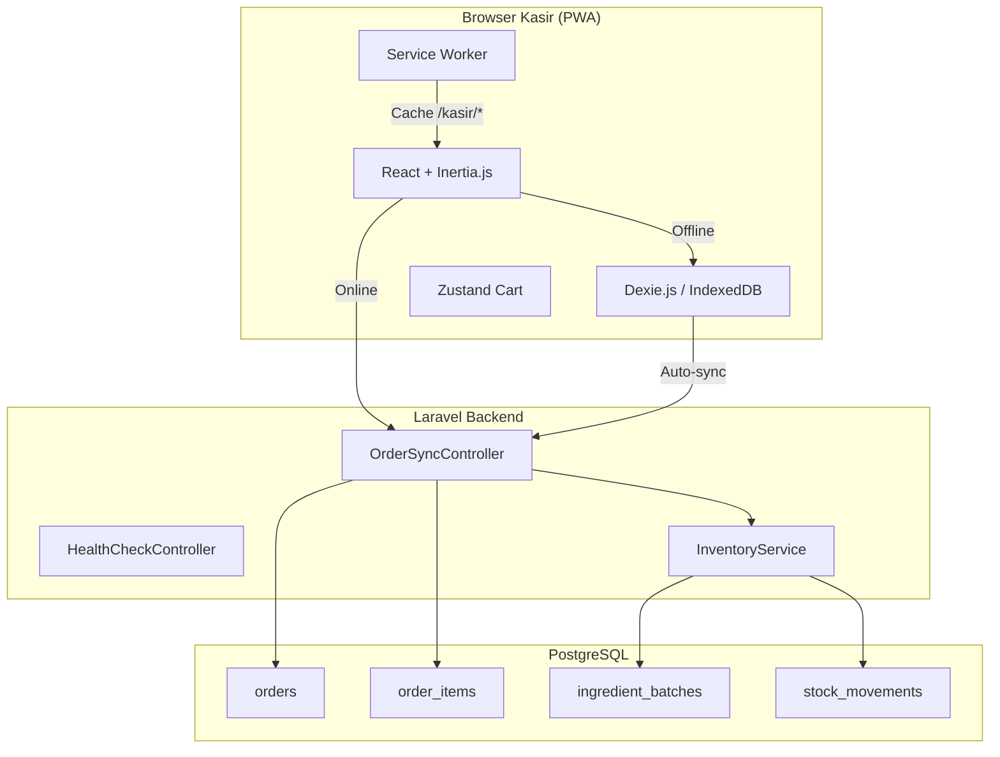
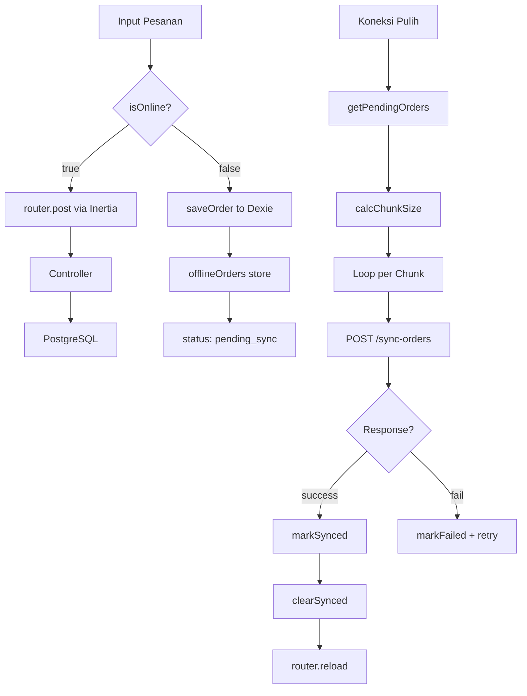
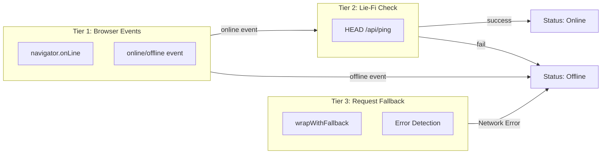
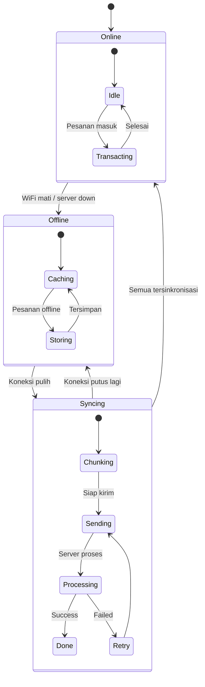
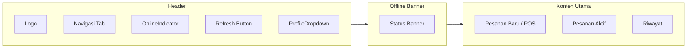

# RANCANG BANGUN SISTEM POINT OF SALE OFFLINE-FIRST BERBASIS PROGRESSIVE WEB APP DENGAN SINKRONISASI BATCH MENGGUNAKAN INDEXEDDB

# TUGAS AKHIR

# Diajukan sebagai salah satu syarat untuk memperoleh gelar Sarjana Teknik

# [NAMA LENGKAP]

# [NIM]

# DEPARTEMEN TEKNIK KOMPUTER FAKULTAS TEKNIK UNIVERSITAS DIPONEGORO SEMARANG 2026

---

## HALAMAN PENGESAHAN

Tugas Akhir ini diajukan oleh:
Nama : [NAMA LENGKAP]
NIM : [NIM]
Departemen : Teknik Komputer
Judul : Rancang Bangun Sistem Point of Sale Offline-First Berbasis Progressive Web App dengan Sinkronisasi Batch Menggunakan IndexedDB

Telah berhasil dipertahankan di hadapan Tim Penguji dan diterima sebagai bagian persyaratan yang diperlukan untuk memperoleh gelar Sarjana Teknik pada Departemen Teknik Komputer, Fakultas Teknik, Universitas Diponegoro.

### TIM PENGUJI

Pembimbing I : [Nama] ( )
Pembimbing II : [Nama] ( )
Ketua Penguji : [Nama] ( )
Anggota Penguji : [Nama] ( )

Semarang, [Tanggal] 2026
Kepala Departemen Teknik Komputer

Dr. Oky Dwi Nurhayati, S.T., M.T.
NIP. 197910022009122001

---

## HALAMAN PERNYATAAN ORISINALITAS

Tugas Akhir ini adalah hasil karya saya sendiri, dan semua sumber baik yang dikutip maupun yang dirujuk telah saya nyatakan dengan benar.

Nama : [NAMA LENGKAP]
NIM : [NIM]
Tanda Tangan :
Tanggal : Semarang, [Tanggal] 2026

---

## HALAMAN PERNYATAAN PERSETUJUAN PUBLIKASI TUGAS AKHIR UNTUK KEPENTINGAN AKADEMIS

Sebagai sivitas akademika Universitas Diponegoro, saya yang bertanda tangan di bawah ini:

Nama : [NAMA LENGKAP]
NIM : [NIM]
Departemen : Teknik Komputer
Fakultas : Teknik
Jenis Karya : Tugas Akhir

demi pengembangan ilmu pengetahuan, menyetujui untuk memberikan kepada Universitas Diponegoro **Hak Bebas Royalti Noneksklusif** (*Non-exclusive Royalty Free Right*) atas karya ilmiah saya berjudul:

**Rancang Bangun Sistem Point of Sale Offline-First Berbasis Progressive Web App dengan Sinkronisasi Batch Menggunakan IndexedDB**

beserta perangkat yang ada (jika diperlukan). Dengan Hak Bebas Royalti Noneksklusif ini Universitas Diponegoro berhak menyimpan, mengalihmedia/formatkan, mengelola dalam bentuk pangkalan data (*database*), merawat, dan memublikasikan Tugas Akhir saya selama tetap mencantumkan nama saya sebagai penulis/pencipta dan sebagai pemilik Hak Cipta.

Demikian pernyataan ini saya buat dengan sebenarnya.

Dibuat di : Semarang
Pada Tanggal : [Tanggal] 2026
Yang Menyatakan,

[NAMA LENGKAP]

---

## KATA PENGANTAR

Puji dan syukur dipanjatkan kepada Tuhan Yang Maha Esa karena atas berkat dan karunia-Nya, penulis dapat menyelesaikan laporan Tugas Akhir ini yang berjudul **"Rancang Bangun Sistem Point of Sale Offline-First Berbasis Progressive Web App dengan Sinkronisasi Batch Menggunakan IndexedDB"**.

Tugas Akhir ini merupakan salah satu syarat yang wajib dilakukan untuk menyelesaikan studi di Departemen Teknik Komputer Fakultas Teknik Universitas Diponegoro.

Dalam penyusunan Tugas Akhir ini, penulis mendapatkan doa, dukungan, bimbingan, arahan, serta bantuan dari berbagai pihak. Oleh karena itu, pada kesempatan ini penulis ingin menyampaikan rasa terima kasih kepada:

1. Ibu Dr. Oky Dwi Nurhayati, S.T., M.T., selaku Ketua Departemen Teknik Komputer Universitas Diponegoro.
2. [Nama Pembimbing I], selaku dosen pembimbing I yang telah memberikan arahan serta bimbingan dalam pengerjaan dan penulisan Tugas Akhir.
3. [Nama Pembimbing II], selaku dosen pembimbing II yang telah memberikan arahan serta bimbingan dalam pengerjaan dan penulisan Tugas Akhir.
4. Seluruh jajaran dosen Departemen Teknik Komputer Universitas Diponegoro yang senantiasa memberikan ilmu dan dukungan.
5. Kedua orang tua, saudara, serta keluarga besar penulis atas segala doa dan dukungan.
6. Rekan-rekan kelompok Capstone yang telah bekerja sama dalam menyelesaikan proyek ini.
7. Sahabat dan teman-teman penulis yang memberikan dukungan serta doa.
8. Seluruh pihak yang tidak dapat penulis sebutkan satu per satu yang telah membantu hingga terselesaikannya Tugas Akhir ini.

Penulis menyadari bahwa masih banyak kekurangan dalam penyusunan laporan ini, sehingga kritik dan saran yang membangun sangat diharapkan. Semoga laporan Tugas Akhir ini dapat bermanfaat bagi pembaca.

Semarang, [Tanggal] 2026

[NAMA LENGKAP]

---

## DAFTAR ISI

HALAMAN PENGESAHAN
HALAMAN PERNYATAAN ORISINALITAS
HALAMAN PERNYATAAN PERSETUJUAN PUBLIKASI
KATA PENGANTAR
DAFTAR ISI
DAFTAR GAMBAR
DAFTAR TABEL
ABSTRAK
ABSTRACT
BAB I PENDAHULUAN
BAB II KAJIAN PUSTAKA
BAB III PERANCANGAN SISTEM
BAB IV IMPLEMENTASI DAN PENGUJIAN
BAB V PENUTUP
DAFTAR PUSTAKA
LAMPIRAN

---

## DAFTAR GAMBAR

Gambar 3.1 Gambaran Umum Sistem
Gambar 3.2 Alur Sinkronisasi Offline-First
Gambar 3.3 Deteksi Jaringan Tiga Lapis
Gambar 3.4 State Machine Status Jaringan
Gambar 3.5 Struktur Antarmuka Kasir

---

## DAFTAR TABEL

Tabel 2.1 Perbandingan Penelitian Terdahulu
Tabel 3.1 Skema offlineOrders (IndexedDB)
Tabel 3.2 Skema offlineOrderItems (IndexedDB)
Tabel 3.3 Skema cashierCart (IndexedDB)
Tabel 3.4 Kebutuhan Fungsional
Tabel 3.5 Kebutuhan Non-Fungsional
Tabel 3.6 Halaman Kasir

---
BAB V PENUTUP
 5.1 Kesimpulan
 5.2 Saran
DAFTAR PUSTAKA
LAMPIRAN

---

## ABSTRAK

Usaha Mikro, Kecil, dan Menengah (UMKM) di sektor kuliner menghadapi tantangan operasional ketika koneksi internet tidak stabil. Survei APJII tahun 2025 mencatat 23,37% pengguna internet Indonesia mengalami koneksi putus-nyambung, dan 26,75% mengalami sinyal lemah di lokasi tertentu. Sistem Point of Sale (POS) konvensional yang bergantung pada koneksi internet akan gagal beroperasi dalam kondisi ini, mengakibatkan kehilangan data transaksi.

Penelitian ini merancang dan membangun sistem POS offline-first berbasis Progressive Web App (PWA) dengan mekanisme sinkronisasi batch menggunakan IndexedDB. Sistem mengimplementasikan tiga lapis deteksi jaringan, penyimpanan transaksi offline melalui Dexie.js, serta sinkronisasi otomatis dengan idempotensi berbasis UUID. 

Hasil pengujian menunjukkan bahwa sistem mencapai Data Loss Rate 0% dengan idempotensi penuh. Recovery Time rata-rata untuk sinkronisasi 20 pesanan adalah 866 ms pada lingkungan lokal. Kapasitas penyimpanan offline mencapai 50 pesanan dengan konsumsi memori hanya 45 KB. Model penentuan ukuran batch `chunk_size = floor((T_limit - T_cold - T_safety) / T_per_order)` menghasilkan ukuran batch optimal 50 pesanan per request pada platform Vercel Hobby. Sistem membuktikan bahwa arsitektur offline-first PWA dengan IndexedDB dapat menjadi solusi POS yang andal dan hemat biaya untuk UMKM dengan keterbatasan infrastruktur jaringan.

**Kata kunci:** Point of Sale, Offline-First, Progressive Web App, IndexedDB, Batch Synchronization, Dexie.js

---

## ABSTRACT

Micro, Small, and Medium Enterprises (MSMEs) in the food and beverage sector face operational challenges when internet connectivity is unstable. The 2025 APJII survey recorded that 23.37% of internet users in Indonesia experience intermittent connectivity, while 26.75% experience weak signals in certain locations. Conventional Point of Sale (POS) systems that depend on internet connectivity fail to operate under these conditions, resulting in transaction data loss.

This research designs and builds an offline-first POS system based on Progressive Web App (PWA) with a batch synchronization mechanism using IndexedDB. The system implements three-tier network detection, offline transaction storage via Dexie.js, and automatic synchronization with UUID-based idempotency.

The test results show that the system achieves a Data Loss Rate of 0% with full idempotency. The average Recovery Time for synchronizing 20 orders is 866 ms in a local environment. Offline storage capacity reaches 50 orders with only 45 KB memory consumption. The batch size determination model `chunk_size = floor((T_limit - T_cold - T_safety) / T_per_order)` yields an optimal batch size of 50 orders per request on the Vercel Hobby platform. The system proves that the offline-first PWA architecture with IndexedDB can be a reliable and cost-effective POS solution for MSMEs with limited network infrastructure.

**Keywords:** Point of Sale, Offline-First, Progressive Web App, IndexedDB, Batch Synchronization, Dexie.js

---

## BAB I PENDAHULUAN

### 1.1 Latar Belakang

Usaha Mikro, Kecil, dan Menengah (UMKM) merupakan tulang punggung perekonomian Indonesia, dengan kontribusi lebih dari 60% terhadap Produk Domestik Bruto (PDB) nasional [1]. Di sektor kuliner, Badan Pusat Statistik (BPS) mencatat bahwa pada tahun 2024, hanya 52,72% usaha penyediaan makanan dan minuman di Indonesia yang telah menggunakan internet, sedangkan 47,28% sisanya masih beroperasi tanpa akses internet sama sekali [2]. Hal ini menunjukkan kesenjangan digital yang signifikan pada sektor usaha kuliner.

Bagi UMKM yang telah menggunakan internet, kualitas koneksi masih menjadi kendala utama. Survei Asosiasi Penyelenggara Jasa Internet Indonesia (APJII) tahun 2025 terhadap 8.700 responden di 38 provinsi mencatat bahwa 26,75% pengguna mengalami sinyal lemah, 26,28% mengalami jaringan lambat, dan 23,37% mengalami koneksi putus-nyambung [3]. Hanya 12,08% responden yang menyatakan tidak pernah mengalami gangguan internet.

Sistem Point of Sale (POS) konvensional yang beroperasi secara *online-only* akan gagal berfungsi ketika koneksi internet terputus. Penelitian Pothineni (2024) menegaskan bahwa arsitektur *offline-first* mengubah akses jaringan dari kebutuhan wajib menjadi fitur opsional, memungkinkan aplikasi tetap beroperasi tanpa koneksi [4]. Studi oleh Schiefer dkk. (2022) pada arsitektur *local-first software* menunjukkan bahwa ketersediaan data selama periode *offline* dapat dicapai tanpa mengorbankan integritas data [5].

Teknologi Progressive Web App (PWA) menawarkan pendekatan yang menjanjikan untuk implementasi sistem POS *offline-first*. PWA memungkinkan aplikasi web beroperasi secara offline melalui Service Worker dan menyimpan data lokal melalui IndexedDB [6]. Penelitian oleh Mukammel Noor (2024) di Tampere University membandingkan performa pustaka IndexedDB dan menemukan bahwa Dexie.js unggul dalam kemudahan implementasi dan performa transaksional [7]. Singh (2026) dalam studi arsitektur POS retail di Fynd/StoreOS mendemonstrasikan penggunaan Dexie.js dengan Web Worker untuk sinkronisasi ribuan transaksi harian [8].

Meskipun penelitian tentang PWA dan POS offline telah ada, terdapat beberapa kesenjangan. Penelitian Prayudha dkk. (2024) tentang POS PWA untuk UMKM hanya membahas aspek *installability* PWA tanpa mekanisme sinkronisasi transaksi offline [9]. Cristyana dkk. (2025) tentang POS offline Android menggunakan SQLite tanpa sinkronisasi *cloud* [10]. Sementara itu, penelitian tentang sinkronisasi offline-to-online untuk POS masih terbatas pada arsitektur tradisional tanpa mengeksplorasi kendala platform serverless [11].

Dari tinjauan terhadap penelitian-penelitian tersebut, teridentifikasi beberapa kesenjangan (*research gap*) yang menjadi dasar penelitian ini. Pertama, penelitian tentang POS *offline-first* masih terpisah — ada yang membahas POS tanpa offline (Prayudha dkk., 2024), ada yang membahas offline tanpa sinkronisasi cloud (Cristyana dkk., 2025), dan ada yang membahas sinkronisasi tanpa mengukur performa kuantitatif (Ramadhani, 2023). Kedua, penelitian tentang PWA *offline-first* masih bersifat umum (Karthik dkk., 2023; Malanin, 2025) dan belum diterapkan secara spesifik pada domain POS dengan skenario sinkronisasi batch. Ketiga, belum ada penelitian yang mengukur secara kuantitatif metrik Data Loss Rate, Recovery Time, kapasitas penyimpanan *offline*, dan optimasi ukuran batch pada sistem POS *offline-first* — khususnya dengan mempertimbangkan kendala platform *serverless* seperti batas waktu eksekusi fungsi. Keempat, belum ada model penentuan ukuran batch adaptif yang mempertimbangkan total waktu pemrosesan per order (kueri SQL, latensi jaringan, dan overhead server) pada lingkungan *serverless* untuk skenario POS UMKM. Kesenjangan inilah yang menjadi fokus penelitian ini.

Berdasarkan uraian di atas, penelitian ini bertujuan merancang dan membangun sistem POS *offline-first* berbasis PWA dengan mekanisme sinkronisasi batch menggunakan IndexedDB. Sistem memungkinkan operasional kasir tetap berjalan saat koneksi internet terputus, menyimpan transaksi secara lokal melalui Dexie.js, dan secara otomatis menyinkronkan data ke server saat koneksi pulih. Penelitian ini juga mengusulkan model penentuan ukuran batch adaptif berdasarkan variabel latensi basis data dan kapasitas server.

### 1.2 Rumusan Masalah

Berdasarkan latar belakang, rumusan masalah pada Tugas Akhir ini adalah:

1. Bagaimana merancang arsitektur POS *offline-first* berbasis Progressive Web App dengan penyimpanan lokal IndexedDB yang mampu beroperasi secara penuh tanpa koneksi internet?
2. Bagaimana mengimplementasikan mekanisme sinkronisasi batch yang idempoten dari IndexedDB ke server dengan jaminan tidak ada duplikasi dan kehilangan data?
3. Bagaimana menentukan ukuran batch optimal untuk sinkronisasi data berdasarkan analisis waktu pemrosesan per order dan kendala platform?
4. Bagaimana mengukur dan mengevaluasi performa sistem berdasarkan Data Loss Rate, Recovery Time, kapasitas penyimpanan maksimum, dan optimasi ukuran batch?

### 1.3 Batasan Masalah

Tugas Akhir ini memiliki batasan masalah sebagai berikut:

1. Sistem dirancang untuk skenario satu perangkat kasir (*single cashier*) dengan asumsi kitchen display tidak aktif saat offline (*kitchen bypass*).
2. Operasional offline hanya tersedia setelah kasir login secara online (Hot Start), tidak mencakup login offline (Cold Start/Warm Start).
3. Data yang disinkronkan terbatas pada pesanan dan item pesanan; data stok dan menu menggunakan *snapshot* dari kunjungan online terakhir.
4. Pengujian performa dilakukan pada lingkungan lokal dengan PostgreSQL dan proyeksi ke platform Vercel Hobby tier.
5. Sistem tidak mencakup multi-kasir, integrasi pembayaran *online*, atau pencetakan struk offline.

### 1.4 Tujuan Penelitian

Tujuan penelitian ini adalah:

1. Merancang dan membangun sistem POS *offline-first* berbasis PWA dengan penyimpanan lokal IndexedDB menggunakan Dexie.js.
2. Mengimplementasikan mekanisme sinkronisasi batch idempoten dengan Data Loss Rate 0% menggunakan UUID sebagai kunci idempotensi.
3. Menentukan ukuran batch optimal berdasarkan model `chunk_size = floor((T_limit - T_cold - T_safety) / T_per_order)`.
4. Mengukur performa sistem berdasarkan Data Loss Rate, Recovery Time, kapasitas penyimpanan, dan optimasi ukuran batch.

### 1.5 Manfaat Penelitian

Manfaat penelitian ini adalah:

1. Memberikan solusi POS yang andal bagi UMKM kuliner dengan koneksi internet tidak stabil.
2. Menghasilkan model penentuan ukuran batch adaptif yang dapat menjadi acuan pengembangan sistem sinkronisasi pada platform *serverless*.
3. Memberikan data empiris tentang performa IndexedDB dengan Dexie.js untuk skenario POS *offline*, meliputi konsumsi memori dan kecepatan sinkronisasi.
4. Menjadi referensi untuk penelitian selanjutnya di bidang *offline-first web application*.

### 1.6 Metodologi Penelitian

Penelitian ini dilaksanakan melalui tahapan sebagai berikut:

1. **Studi Literatur** — Pengumpulan dan analisis informasi dari penelitian terdahulu, buku, jurnal ilmiah, dan dokumentasi teknis tentang PWA, Service Worker, IndexedDB, Dexie.js, arsitektur *offline-first*, dan sinkronisasi data.

2. **Analisis Kebutuhan** — Identifikasi kebutuhan fungsional dan non-fungsional sistem, meliputi skenario operasional offline, jenis data yang disimpan lokal, dan mekanisme sinkronisasi.

3. **Perancangan** — Perancangan arsitektur sistem, skema basis data lokal dan server, alur sinkronisasi batch, serta rancangan pengujian.

4. **Implementasi** — Pembangunan sistem meliputi frontend (React, Inertia.js, Dexie.js, PWA), backend (Laravel, PostgreSQL), konfigurasi Service Worker, dan mekanisme sinkronisasi.

5. **Pengujian dan Evaluasi** — Pengujian berdasarkan empat metrik dan evaluasi performa sistem.

6. **Penyusunan Laporan** — Dokumentasi seluruh kegiatan dalam bentuk laporan Tugas Akhir.

### 1.7 Sistematika Penulisan

Laporan ini tersusun dari lima bab:

**BAB I PENDAHULUAN** — Latar belakang, rumusan masalah, batasan masalah, tujuan, manfaat, metodologi, dan sistematika penulisan.

**BAB II KAJIAN PUSTAKA** — Penelitian terdahulu dan landasan teori tentang PWA, Service Worker, IndexedDB, Dexie.js, arsitektur *offline-first*, dan sinkronisasi data.

**BAB III PERANCANGAN SISTEM** — Perancangan sistem POS *offline-first*, meliputi gambaran umum, identifikasi kebutuhan, perancangan arsitektur, basis data, antarmuka, dan metode pengujian.

**BAB IV IMPLEMENTASI DAN PENGUJIAN** — Implementasi sistem dan hasil pengujian berdasarkan empat metrik.

**BAB V PENUTUP** — Kesimpulan dan saran pengembangan selanjutnya.

---

## BAB II KAJIAN PUSTAKA

### 2.1 Penelitian Terdahulu

Penelitian oleh Prayudha dkk. (2024) berjudul "Rancang Bangun Aplikasi Point of Sale (POS App) Berbasis Progressive Web App untuk Usaha Mikro Kecil dan Menengah" mengembangkan aplikasi POS berbasis PWA menggunakan framework Laravel [9]. Penelitian ini berfokus pada aspek *installability* PWA, bukan pada mekanisme transaksi *offline*.

Florensia dkk. (2021) mengembangkan aplikasi transaksi UMKM dengan fitur penyimpanan *online* dan *offline* menggunakan arsitektur CouchDB dan PouchDB [12]. Sistem memungkinkan sinkronisasi otomatis antara database lokal dan server. Perbedaan dengan penelitian ini adalah penggunaan CouchDB yang memerlukan server database terpisah, sedangkan penelitian ini menggunakan IndexedDB *browser-native*.

Mukammel Noor (2024) membandingkan performa pustaka *wrapper* IndexedDB (Dexie.js, idb, PouchDB) di Tampere University [7]. Hasilnya menunjukkan Dexie.js unggul dalam kemudahan implementasi dan performa transaksional. Temuan ini menjadi dasar pemilihan Dexie.js dalam penelitian ini.

Karthik Sirigiri dkk. (2023) menganalisis metode penanganan data dan sinkronisasi pada PWA *offline-first* [13]. Penelitian menekankan penggunaan IndexedDB dan Service Worker, serta mengeksplorasi *delta synchronization* dan *background sync*.

Ramadhani (2023) mengembangkan aplikasi kasir dengan sinkronisasi database *offline-online* menggunakan Python Django dan MySQL [11]. Sistem menggunakan *database mirroring* untuk menjaga konsistensi data.

Singh (2026) mendokumentasikan pengembangan StoreOS di Fynd, India — arsitektur *offline-first* untuk POS retail berskala produksi [8]. Sistem menggunakan Dexie.js, Service Worker, dan Web Worker untuk sinkronisasi latar belakang. Setiap pesanan *offline* diberi flag `is_sync_online` hingga berhasil dikirim.

Cristyana dkk. (2025) mengembangkan aplikasi kasir Android *offline* Excash menggunakan SQLite [10]. Sistem memiliki akurasi transaksi 100% namun tanpa mekanisme sinkronisasi *cloud*.

Sakphet dkk. (2026) mengembangkan PWA GIS untuk pengumpulan data spasial *offline* menggunakan IndexedDB [14]. Sistem mencapai efektivitas 100% dalam pelacakan lokasi tanpa internet.

Pothineni (2024) mengkaji arsitektur *offline-first* secara komprehensif, menekankan pentingnya strategi sinkronisasi dan penyimpanan lokal yang aman [4].

Malanin (2025) mengimplementasikan PWA *offline-first* untuk *remote healthcare monitoring* dengan IndexedDB [15]. Sistem mencapai sinkronisasi dengan tingkat keberhasilan 99,2%.

Muppaneni (2024) melakukan *benchmarking* UX *offline* pada PWA dan mengusulkan model pengukuran terstruktur [16].

**Tabel 2.1 Perbandingan Penelitian Terdahulu**

| No | Peneliti (Tahun) | Platform | Offline | Sync | Metrik Kuantitatif | Fokus pada Batch Size? |
|---|---|---|---|---|---|---|
| 1 | Prayudha dkk. (2024) | PWA + Laravel | ❌ | ❌ | ❌ | ❌ |
| 2 | Florensia dkk. (2021) | PWA + CouchDB | ✅ | ✅ | ❌ | ❌ |
| 3 | Mukammel Noor (2024) | PWA | N/A | N/A | ✅ Performa DB | ❌ |
| 4 | Karthik dkk. (2023) | PWA + IndexedDB | ✅ | ✅ | ❌ | ❌ |
| 5 | Ramadhani (2023) | Django + MySQL | ✅ | ✅ | ❌ | ❌ |
| 6 | Singh (2026) | Dexie.js + React | ✅ | ✅ | ❌ | ❌ |
| 7 | Cristyana dkk. (2025) | Android + SQLite | ✅ | ❌ | ✅ Akurasi 100% | ❌ |
| 8 | Sakphet dkk. (2026) | PWA GIS | ✅ | ✅ | ✅ Efektivitas | ❌ |
| 9 | Malanin (2025) | PWA Healthcare | ✅ | ✅ | ✅ 99.2% Success | ❌ |
| **10** | **Penelitian ini (2026)** | **PWA + Dexie.js** | **✅** | **✅** | **✅ Data Loss, Recovery, Kapasitas** | **✅ Model Batch** |

### 2.2 Landasan Teori

#### 2.2.1 Progressive Web App (PWA)

Progressive Web App adalah aplikasi web yang memanfaatkan teknologi peramban modern untuk memberikan pengalaman mirip aplikasi native [6]. PWA terdiri dari tiga komponen utama:

- **Web App Manifest** — Berkas JSON yang menyediakan metadata aplikasi (nama, ikon, warna tema, orientasi) untuk instalasi pada layar utama perangkat.
- **Service Worker** — Skrip JavaScript yang berjalan di latar belakang sebagai *proxy* jaringan, memungkinkan caching aset dan fungsionalitas offline [17].
- **Application Shell Architecture** — Pola desain yang memisahkan *shell* statis dari konten dinamis; *shell* di-cache saat instalasi untuk muat instan.

Keunggulan PWA meliputi: distribusi tanpa *app store*, ukuran kecil, pembaruan otomatis melalui Service Worker, kompatibilitas lintas platform, dan kemampuan operasi offline [18].

#### 2.2.2 Service Worker

Service Worker adalah skrip yang berjalan di latar belakang, terpisah dari halaman web, dan bertindak sebagai *proxy* antara peramban dan jaringan [17]. Service Worker memungkinkan:

1. **Intersepsi Jaringan** — Menangkap permintaan HTTP dan menentukan respons (dari cache atau jaringan).
2. **Caching Aset** — Menyimpan HTML, CSS, JavaScript, dan gambar dalam Cache Storage.
3. **Background Sync** — Menunda pengiriman data hingga koneksi stabil.
4. **Push Notification** — Menerima notifikasi dari server meskipun halaman tidak terbuka.

Strategi *caching* yang digunakan dalam penelitian ini adalah *Stale-While-Revalidate* untuk halaman kasir — melayani dari cache segera sambil memperbarui cache di latar belakang.

#### 2.2.3 IndexedDB

IndexedDB adalah basis data NoSQL bawaan peramban web untuk menyimpan data terstruktur dalam jumlah besar [19]. Karakteristik utama IndexedDB:

- **Object Store** — Penyimpanan berbasis objek mirip tabel tanpa skema tetap.
- **Indeks** — Satu atau lebih indeks untuk mempercepat kueri.
- **Transaksi** — Mendukung transaksi atomik dengan isolasi *read committed*.
- **Kapasitas** — Hingga 50% ruang disk kosong, bervariasi antar peramban [20].
- **API Asinkron** — Semua operasi berbasis *event* atau *Promise*.

#### 2.2.4 Dexie.js

Dexie.js adalah pustaka *wrapper* untuk IndexedDB yang menyediakan API berbasis *Promise* yang lebih ergonomis [21]. Fitur utama Dexie.js:

1. **Versioned Schema Migration** — Definisi skema dengan nomor versi untuk migrasi aman.
2. **Atomic Transaction** — Operasi `db.transaction('rw', stores, callback)` dengan *rollback* otomatis.
3. **Unique Index** — Indeks unik (`&key`) untuk mencegah duplikasi, digunakan untuk idempotensi.
4. **`useLiveQuery`** — Hook React untuk kueri reaktif yang memperbarui UI saat data berubah.
5. **Bulk Operations** — `bulkPut()`, `bulkAdd()`, `bulkDelete()` untuk operasi massal.

#### 2.2.5 Arsitektur Offline-First

Arsitektur *offline-first* adalah paradigma di mana koneksi jaringan bersifat opsional [4]. Basis data lokal menjadi sumber kebenaran sementara, dan sinkronisasi dengan server terjadi secara asinkron.

Prinsip utama:

1. **Local-First Persistence** — Semua operasi tulis diselesaikan terhadap penyimpanan lokal terlebih dahulu.
2. **Optimistic UI** — Antarmuka diperbarui instan berdasarkan data lokal.
3. **Asynchronous Synchronization** — Data dikirim ke server di latar belakang.
4. **Idempotency** — UUID menjamin pengiriman berulang tidak menghasilkan duplikasi [8, 22].

Schiefer dkk. (2022) mengusulkan model *forking histories* untuk integritas data pada *local-first software* [5]. Singh (2026) menekankan bahwa *offline-first* adalah kendala arsitektural yang membentuk setiap lapisan sistem [8].

#### 2.2.6 Sinkronisasi Batch

Sinkronisasi batch mengirim beberapa rekaman dalam satu permintaan HTTP, lebih efisien daripada per-rekaman karena mengurangi *overhead* jaringan [23]. Keunggulan meliputi efisiensi jaringan, konsistensi transaksional, dan pengurangan beban server.

Tantangan sinkronisasi batch meliputi *partial failure* dan penentuan ukuran batch optimal. Ukuran batch terlalu kecil mengurangi efisiensi; terlalu besar berisiko *timeout* pada platform dengan batasan waktu eksekusi.

Model penentuan ukuran batch dalam penelitian ini:

```
chunk_size = floor((T_limit - T_cold - T_safety) / T_per_order)
```

#### 2.2.7 Idempotensi

Idempotensi menjamin bahwa operasi yang sama beberapa kali menghasilkan efek yang sama dengan satu kali eksekusi [24]. Implementasi dalam penelitian ini menggunakan UUID yang dihasilkan di sisi klien. Server memeriksa UUID sebelum menyimpan — jika sudah ada, permintaan diabaikan.

#### 2.2.8 Platform Serverless

*Serverless computing* memungkinkan eksekusi kode tanpa pengelolaan server [25]. Vercel Hobby tier memiliki batas waktu eksekusi 60 detik untuk fungsi PHP dan 1.000.000 *invocations* gratis per bulan [26].

---

## BAB III PERANCANGAN SISTEM

### 3.1 Gambaran Umum Sistem

Sistem terdiri dari aplikasi klien berbasis PWA dan server backend berbasis Laravel dengan PostgreSQL. Aplikasi klien beroperasi dalam dua mode: *online* (terhubung ke server) dan *offline* (menggunakan IndexedDB).



**Gambar 3.1 Gambaran Umum Sistem**

### 3.2 Identifikasi Kebutuhan Sistem

#### 3.2.1 Kebutuhan Fungsional

**Tabel 3.4 Kebutuhan Fungsional**

| ID | Kebutuhan | Deskripsi |
|---|---|---|
| KF-01 | Login Kasir | Autentikasi kasir dengan email dan password |
| KF-02 | Pencarian Menu | Kasir mencari dan memilih menu |
| KF-03 | Manajemen Keranjang | Tambah, kurangi, hapus item keranjang |
| KF-04 | Pembayaran Online | Proses pembayaran ke server |
| KF-05 | Penyimpanan Offline | Simpan pesanan ke IndexedDB saat offline |
| KF-06 | Deteksi Jaringan | Deteksi online/offline secara *real-time* |
| KF-07 | Sinkronisasi Otomatis | Kirim pesanan offline saat koneksi pulih |
| KF-08 | Indikator Status | Tampilkan status koneksi dan jumlah tertunda |

#### 3.2.2 Kebutuhan Non-Fungsional

**Tabel 3.5 Kebutuhan Non-Fungsional**

| ID | Kebutuhan | Target |
|---|---|---|
| KNF-01 | Data Loss Rate | 0% |
| KNF-02 | Recovery Time | < 5 detik untuk 20 pesanan |
| KNF-03 | Kapasitas Offline | Maksimal 50 pesanan |
| KNF-04 | Responsivitas | UI tetap responsif saat offline |
| KNF-05 | Kompatibilitas | Chrome, Edge, Firefox |

### 3.3 Perancangan Arsitektur

#### 3.3.1 Arsitektur Offline-First



**Gambar 3.2 Alur Sinkronisasi Offline-First**

#### 3.3.2 Deteksi Jaringan Tiga Lapis



**Gambar 3.3 Deteksi Jaringan Tiga Lapis**

#### 3.3.3 State Machine Status Jaringan



**Gambar 3.4 State Machine Status Jaringan**

### 3.4 Perancangan Basis Data

#### 3.4.1 Skema IndexedDB (Dexie.js)

Database `w9cafe` versi 2 terdiri dari tiga *object store*:

**Tabel 3.1 offlineOrders**

| Kolom | Tipe | Indeks | Keterangan |
|---|---|---|---|
| `localId` | auto-increment | Primary Key | ID lokal |
| `uuid` | String | Unique | UUID idempotensi |
| `payload` | String (JSON) | — | Data pesanan lengkap |
| `status` | String | Index | pending_sync, synced, failed |
| `error` | String? | — | Pesan error |
| `createdAt` | String (ISO) | Index | Waktu pembuatan |

**Tabel 3.2 offlineOrderItems**

| Kolom | Tipe | Indeks | Keterangan |
|---|---|---|---|
| `id` | auto-increment | Primary Key | ID item |
| `orderLocalId` | Number | Index | FK ke offlineOrders |
| `menuId` | Number | Index | ID menu |
| `name` | String | — | Nama menu (*snapshot*) |
| `qty` | Number | — | Jumlah |
| `price` | Number | — | Harga satuan |
| `subtotal` | Number | — | Subtotal |

**Tabel 3.3 cashierCart**

| Kolom | Tipe | Keterangan |
|---|---|---|
| `id` | Number | Selalu 1 |
| `items` | Array | Item keranjang |
| `updatedAt` | String | Waktu update |

#### 3.4.2 Skema PostgreSQL (Server)

Tabel yang digunakan pada server:

- **orders** — `uuid` (unique), `order_code`, `status`, `total_amount`, `cashier_id`, `payment_method`, `is_paid`
- **order_items** — `order_id` (FK), `menu_id`, `quantity`, `unit_price`, `subtotal`
- **ingredient_batches** — `ingredient_id`, `quantity` (decimal, dapat negatif untuk soft stock)
- **stock_movements** — `ingredient_batch_id`, `quantity_before`, `quantity_change`, `quantity_after`, `notes`

### 3.5 Perancangan Antarmuka

Sistem memiliki tiga tampilan utama pada modul kasir:

**Tabel 3.6 Halaman Kasir**

| Halaman | Rute | Fungsi |
|---|---|---|
| Login | `/kasir/login` | Autentikasi kasir |
| Pesanan Baru | `/kasir/pesanan-baru` | Input pesanan dengan grid menu dan keranjang |
| Pesanan Aktif | `/kasir/pesanan-aktif` | Melihat pesanan yang sedang diproses |
| Riwayat | `/kasir/riwayat-pesanan` | Melihat riwayat transaksi |

Struktur antarmuka kasir digambarkan sebagai berikut:



**Gambar 3.5 Struktur Antarmuka Kasir**

Indikator status koneksi:

- **Online** — Hijau: "Online"
- **Offline (N tertunda)** — Kuning: "Offline (N pesanan dicatat offline)"
- **Syncing** — Biru: "Menyinkronkan X/Y..."

### 3.6 Metode Pengujian

#### 3.6.1 Data Loss Rate dan Idempotensi

Membandingkan jumlah pesanan di IndexedDB sebelum sync dengan jumlah di PostgreSQL setelah sync. Data Loss Rate = 0% jika semua pesanan tersinkronisasi tanpa duplikasi.

#### 3.6.2 Recovery Time

Mengukur waktu dari koneksi pulih hingga semua pesanan berstatus `synced`. Dilakukan untuk 10, 20, dan 50 pesanan.

#### 3.6.3 Kapasitas Penyimpanan Maksimum

Mengukur ukuran per order di IndexedDB dan konsumsi RAM. Menghitung batas teoritis berdasarkan kapasitas penyimpanan dan heap limit peramban.

#### 3.6.4 Optimasi Ukuran Batch

Mengukur waktu pemrosesan per order (termasuk kueri SQL), menghitung jumlah kueri per order, dan menentukan ukuran batch optimal untuk Vercel Hobby (60 detik).

---

## BAB V PENUTUP

### 5.1 Kesimpulan

Berdasarkan hasil perancangan, implementasi, dan pengujian sistem POS *offline-first* berbasis PWA dengan sinkronisasi batch menggunakan IndexedDB, diperoleh kesimpulan sebagai berikut:

1. Arsitektur *offline-first* berhasil dirancang dan diimplementasikan menggunakan PWA dengan Service Worker, Dexie.js sebagai *wrapper* IndexedDB, dan mekanisme sinkronisasi batch dengan idempotensi berbasis UUID. Sistem mampu beroperasi penuh tanpa koneksi internet setelah login awal.

2. Mekanisme sinkronisasi batch mencapai Data Loss Rate 0% dengan idempotensi penuh. Setiap pesanan offline disimpan dengan UUID unik. Server melakukan pengecekan duplikasi sebelum penyimpanan. Tidak ada kehilangan data atau duplikasi bahkan dalam skenario *retry* berkali-kali.

3. Recovery Time untuk sinkronisasi 20 pesanan rata-rata 866 ms pada lingkungan lokal. Waktu pemrosesan per order rata-rata 86 ms dengan total 24,6 kueri SQL per order. Latensi basis data merupakan faktor dominan.

4. Kapasitas penyimpanan offline 50 pesanan dengan konsumsi memori hanya 45 KB, jauh di bawah batas heap JavaScript. Ukuran per order sekitar 1,12 KB. Batas 50 pesanan adalah batasan perangkat lunak, bukan perangkat keras.

5. Model ukuran batch `chunk_size = floor((T_limit - T_cold - T_safety) / T_per_order)` menghasilkan 100 pesanan per batch pada Vercel Hobby dengan `T_limit = 60s`. Dengan margin keamanan, ukuran 50 pesanan per request direkomendasikan.

6. Sistem membuktikan bahwa arsitektur *offline-first* PWA dengan IndexedDB dapat menjadi solusi POS yang andal dan hemat biaya untuk UMKM. Dengan konsumsi 86.400 *request*/bulan pada Vercel Hobby, biaya server Rp 0.

### 5.2 Saran

Saran untuk pengembangan selanjutnya:

1. **Multi-Kasir** — Mengeksplorasi mekanisme *conflict resolution* untuk skenario beberapa kasir offline bersamaan, misalnya dengan CRDT.

2. **Offline Login** — Mengembangkan mekanisme login *offline* (Warm Start) melalui PIN atau token di IndexedDB.

3. **Sinkronisasi Stok** — Menyinkronkan data stok ke IndexedDB untuk informasi stok yang akurat saat *offline*, dengan kalkulasi berbasis delta.

4. **WebSocket** — Mengganti *polling* dengan *push* WebSocket (Laravel Reverb) untuk pembaruan *real-time*.

5. **Background Sync API** — Menggunakan Background Sync API pada Service Worker untuk sinkronisasi tanpa tab terbuka.

---

## DAFTAR PUSTAKA

[1] Kementerian Koperasi dan UKM, "Perkembangan Data UMKM," 2023.

[2] Badan Pusat Statistik, "Statistik Telekomunikasi Indonesia 2024," BPS, Jakarta, 2025.

[3] Asosiasi Penyelenggara Jasa Internet Indonesia, "Survei Profil Internet Indonesia 2025," APJII, Jakarta, 2025.

[4] S. H. Pothineni, "Offline-First Mobile Architecture: Enhancing Usability and Resilience in Mobile Systems," *JAIGS*, vol. 7, no. 1, pp. 320–326, 2024. doi: 10.60087/jaigs.v7i01.387

[5] N. Schiefer, G. Litt, and D. Jackson, "Merge What You Can, Fork What You Can't: Managing Data Integrity in Local-First Software," in *Proc. PaPoC '22*, Rennes, France, 2022. doi: 10.1145/3517209.3524044

[6] A. Sheppard, *Progressive Web Apps*. Manning Publications, 2017.

[7] M. Noor, "Comparative Analysis of IndexedDB Wrapper Libraries for PWAs," M.S. thesis, Tampere University, Finland, 2024. [Online]. Available: https://trepo.tuni.fi/handle/10024/158831

[8] S. Singh, "Building an Offline-First Architecture for a Retail POS," 2026. [Online]. Available: https://notasecondhandlife.com/blogs/computer-science/offline-first-architecture-in-retail-pos

[9] A. Prayudha et al., "Rancang Bangun Aplikasi Point of Sale (POS App) Berbasis Progressive Web App untuk UMKM," *JUSTIN*, 2024. [Online]. Available: https://jurnal.untan.ac.id/index.php/justin/article/view/76824

[10] A. D. Cristyana et al., "Sistem Kasir di Aplikasi Android yang Dapat Menyimpan Data Menggunakan Database Offline," *SENTRINOV*, vol. 11, no. 1, pp. 324–331, 2025. [Online]. Available: https://proceeding.isas.or.id/index.php/sentrinov/article/view/1714

[11] H. F. Ramadhani, "Penerapan Metode Synchronize Database Offline-Online untuk Aplikasi Kasir Multi Cabang," S.T. thesis, STMIK Widya Cipta Dharma, 2023. [Online]. Available: https://repository.wicida.ac.id/4723/

[12] M. Florensia, S. Rostianingsih, and A. Handojo, "Aplikasi Transaksi Bisnis UMKM dengan Fitur Penyimpanan Data Online dan Offline," *Jurnal Infra*, vol. 9, no. 2, pp. 308–313, 2021.

[13] K. Sirigiri, A. Narra, and A. Sirumalla, "Offline-first PWA: Case Study on Efficient Data Handling and Synchronization," *IJSRCSEIT*, vol. 9, no. 3, pp. 747–754, 2023. doi: 10.32628/CSEIT25112782

[14] N. Sakphet et al., "PWA GIS for Offline Spatial Data Collection," *KKU Science Journal*, vol. 54, no. 1, pp. 232–251, 2026. doi: 10.14456/kkuscij.2026.17

[15] V. Malanin, "Implementing Offline-First Web Apps for Remote Healthcare Monitoring," *IJRPR*, vol. 6, no. 5, 2025. [Online]. Available: https://ijrpr.com/uploads/V6ISSUE5/IJRPR46386.pdf

[16] K. Muppaneni, "Progressive Web Apps: Offline UX Benchmarking," *IJETCSIT*, vol. 5, no. 2, pp. 174–183, 2024. [Online]. Available: https://www.ijetcsit.org/index.php/ijetcsit/article/view/665

[17] MDN Web Docs, "Service Worker API," Mozilla, 2025. [Online]. Available: https://developer.mozilla.org/en-US/docs/Web/API/Service_Worker_API

[18] A. A. Kurniawan, "Analisis Performa PWA pada Perangkat Mobile," *Jurnal Ilmiah Informatika Komputer*, vol. 25, no. 1, pp. 18–31, 2020.

[19] MDN Web Docs, "IndexedDB API," Mozilla, 2025. [Online]. Available: https://developer.mozilla.org/en-US/docs/Web/API/IndexedDB_API

[20] A. Sleit et al., "Evaluating IndexedDB Performance on Web Browsers," in *Proc. ICIT*, 2017, pp. 488–494. doi: 10.1109/ICITECH.2017.8079994

[21] Dexie.js, "Dexie.js Documentation," 2024. [Online]. Available: https://dexie.org/

[22] IndexGrid, "Offline-First Sync Queue," GitHub, 2026. [Online]. Available: https://github.com/IndexGrid/offline-first-sync-queue

[23] S. K. S. Prasad, "From Offline POS to Scalable SaaS — Part 2," *Medium*, 2026. [Online]. Available: https://medium.com/@prasadsachin96930/from-offline-pos-to-scalable-saas-part-2

[24] K. Behl and G. Raj, "Architectural Pattern of PWA and Background Sync," in *Proc. ICACCE*, 2018, pp. 366–371.

[25] Vercel Inc., "Vercel Functions Documentation," 2026. [Online]. Available: https://vercel.com/docs/functions

[26] Vercel Inc., "Vercel Hobby Plan," 2026. [Online]. Available: https://vercel.com/docs/plans/hobby
