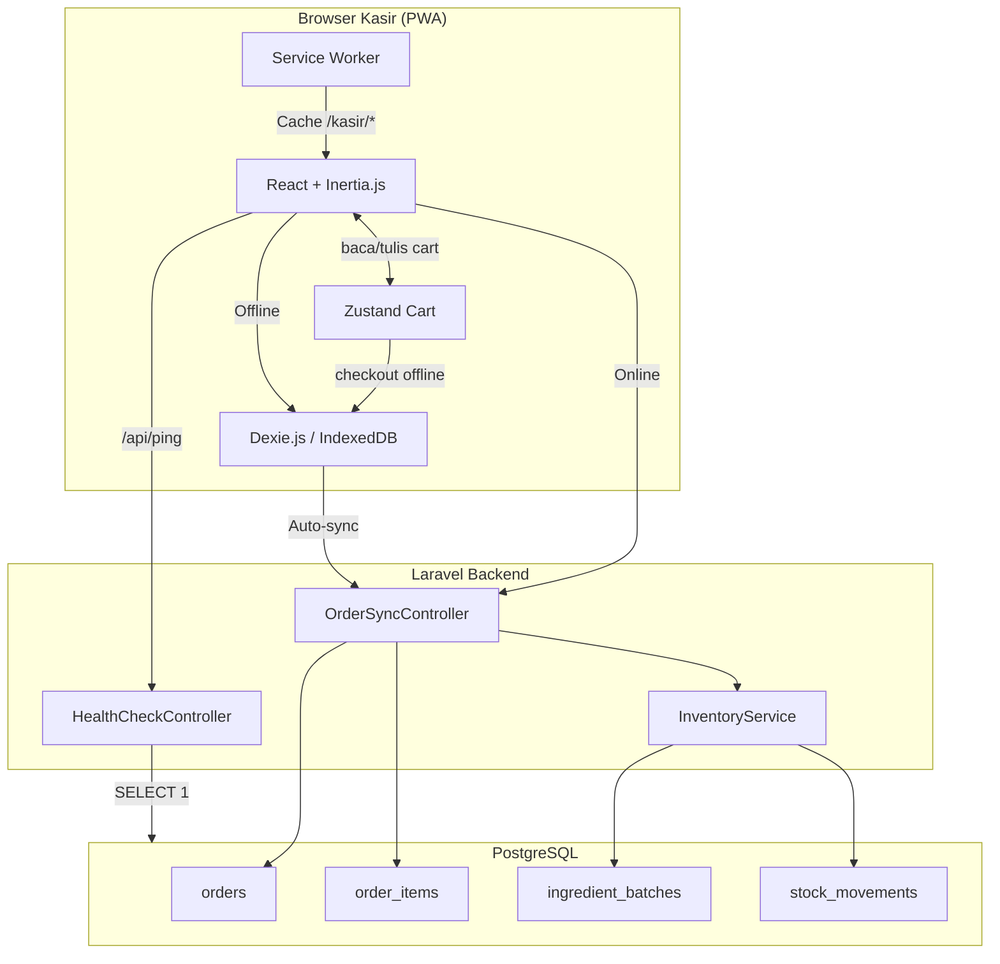
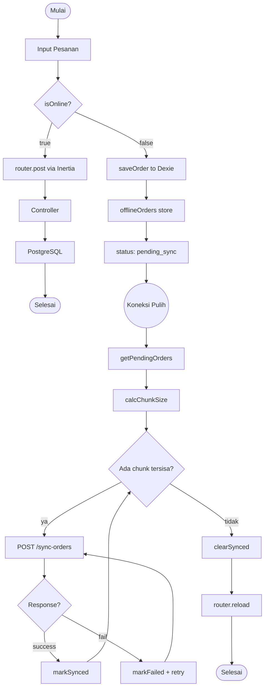
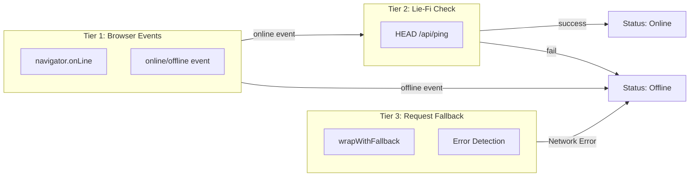
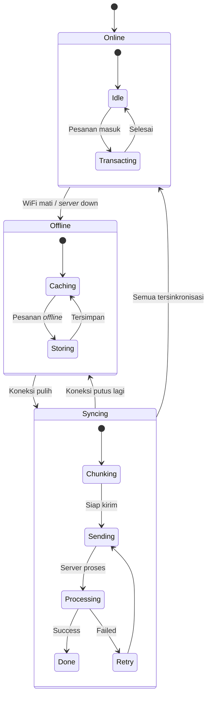
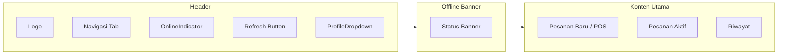
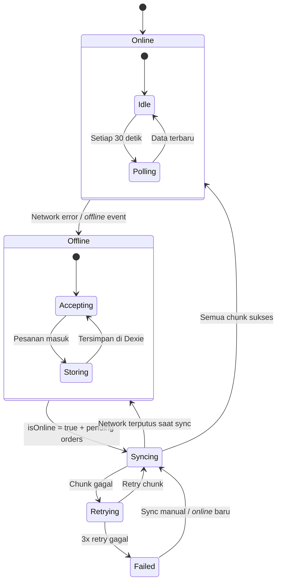

# RANCANG BANGUN SISTEM POINT OF SALE OFFLINE-FIRST BERBASIS PROGRESSIVE WEB APP DENGAN SINKRONISASI BATCH MENGGUNAKAN INDEXEDDB

# TUGAS AKHIR

# Diajukan sebagai salah satu syarat untuk memperoleh gelar Sarjana Teknik

# [NAMA LENGKAP]

# [NIM]

# DEPARTEMEN TEKNIK KOMPUTER FAKULTAS TEKNIK UNIVERSITAS DIPONEGORO SEMARANG 2026

---

## HALAMAN PENGESAHAN

Tugas Akhir ini diajukan oleh:
Nama : [NAMA LENGKAP]
NIM : [NIM]
Departemen : Teknik Komputer
Judul : Rancang Bangun Sistem Point of Sale Offline-First Berbasis Progressive Web App dengan Sinkronisasi Batch Menggunakan IndexedDB

Telah berhasil dipertahankan di hadapan Tim Penguji dan diterima sebagai bagian persyaratan yang diperlukan untuk memperoleh gelar Sarjana Teknik pada Departemen Teknik Komputer, Fakultas Teknik, Universitas Diponegoro.

### TIM PENGUJI

Pembimbing I : [Nama] ( )
Pembimbing II : [Nama] ( )
Ketua Penguji : [Nama] ( )
Anggota Penguji : [Nama] ( )

Semarang, [Tanggal] 2026
Kepala Departemen Teknik Komputer

Dr. Oky Dwi Nurhayati, S.T., M.T.
NIP. 197910022009122001

---

## HALAMAN PERNYATAAN ORISINALITAS

Tugas Akhir ini adalah hasil karya saya sendiri, dan semua sumber baik yang dikutip maupun yang dirujuk telah saya nyatakan dengan benar.

Nama : [NAMA LENGKAP]
NIM : [NIM]
Tanda Tangan :
Tanggal : Semarang, [Tanggal] 2026

---

## HALAMAN PERNYATAAN PERSETUJUAN PUBLIKASI TUGAS AKHIR UNTUK KEPENTINGAN AKADEMIS

Sebagai sivitas akademika Universitas Diponegoro, saya yang bertanda tangan di bawah ini:

Nama : [NAMA LENGKAP]
NIM : [NIM]
Departemen : Teknik Komputer
Fakultas : Teknik
Jenis Karya : Tugas Akhir

demi pengembangan ilmu pengetahuan, menyetujui untuk memberikan kepada Universitas Diponegoro **Hak Bebas Royalti Noneksklusif** (*Non-exclusive Royalty Free Right*) atas karya ilmiah saya berjudul:

**Rancang Bangun Sistem Point of Sale Offline-First Berbasis Progressive Web App dengan Sinkronisasi Batch Menggunakan IndexedDB**

beserta perangkat yang ada (jika diperlukan). Dengan Hak Bebas Royalti Noneksklusif ini Universitas Diponegoro berhak menyimpan, mengalihmedia/formatkan, mengelola dalam bentuk pangkalan data (*database*), merawat, dan memublikasikan Tugas Akhir saya selama tetap mencantumkan nama saya sebagai penulis/pencipta dan sebagai pemilik Hak Cipta.

Demikian pernyataan ini saya buat dengan sebenarnya.

Dibuat di : Semarang
Pada Tanggal : [Tanggal] 2026
Yang Menyatakan,

[NAMA LENGKAP]

---

## KATA PENGANTAR

Puji dan syukur dipanjatkan kepada Tuhan Yang Maha Esa karena atas berkat dan karunia-Nya, penulis dapat menyelesaikan laporan Tugas Akhir ini yang berjudul **"Rancang Bangun Sistem Point of Sale Offline-First Berbasis Progressive Web App dengan Sinkronisasi Batch Menggunakan IndexedDB"**.

Tugas Akhir ini merupakan salah satu syarat yang wajib dilakukan untuk menyelesaikan studi di Departemen Teknik Komputer Fakultas Teknik Universitas Diponegoro.

Dalam penyusunan Tugas Akhir ini, penulis mendapatkan doa, dukungan, bimbingan, arahan, serta bantuan dari berbagai pihak. Oleh karena itu, pada kesempatan ini penulis ingin menyampaikan rasa terima kasih kepada:

1. Ibu Dr. Oky Dwi Nurhayati, S.T., M.T., selaku Ketua Departemen Teknik Komputer Universitas Diponegoro.
2. [Nama Pembimbing I], selaku dosen pembimbing I yang telah memberikan arahan serta bimbingan dalam pengerjaan dan penulisan Tugas Akhir.
3. [Nama Pembimbing II], selaku dosen pembimbing II yang telah memberikan arahan serta bimbingan dalam pengerjaan dan penulisan Tugas Akhir.
4. Seluruh jajaran dosen Departemen Teknik Komputer Universitas Diponegoro yang senantiasa memberikan ilmu dan dukungan.
5. Kedua orang tua, saudara, serta keluarga besar penulis atas segala doa dan dukungan.
6. Rekan-rekan kelompok Capstone yang telah bekerja sama dalam menyelesaikan proyek ini.
7. Sahabat dan teman-teman penulis yang memberikan dukungan serta doa.
8. Seluruh pihak yang tidak dapat penulis sebutkan satu per satu yang telah membantu hingga terselesaikannya Tugas Akhir ini.

Penulis menyadari bahwa masih banyak kekurangan dalam penyusunan laporan ini, sehingga kritik dan saran yang membangun sangat diharapkan. Semoga laporan Tugas Akhir ini dapat bermanfaat bagi pembaca.

Semarang, [Tanggal] 2026

[NAMA LENGKAP]

---

## DAFTAR ISI

HALAMAN PENGESAHAN
HALAMAN PERNYATAAN ORISINALITAS
HALAMAN PERNYATAAN PERSETUJUAN PUBLIKASI
KATA PENGANTAR
DAFTAR ISI
DAFTAR GAMBAR
DAFTAR TABEL
ABSTRAK
ABSTRACT
BAB I PENDAHULUAN
BAB II KAJIAN PUSTAKA
BAB III PERANCANGAN SISTEM
 3.1 Gambaran Umum Sistem
 3.2 Identifikasi Kebutuhan Sistem
 3.3 Perancangan Arsitektur
 3.4 Lingkungan Pengembangan Sistem
 3.5 Perancangan Basis Data
 3.6 Perancangan Antarmuka
 3.7 Metode Pengujian
BAB IV IMPLEMENTASI DAN PENGUJIAN
 4.1 Implementasi Produk
 4.2 Pengujian Produk
BAB V PENUTUP
DAFTAR PUSTAKA
LAMPIRAN

---

## DAFTAR GAMBAR

Gambar 3.1 Gambaran Umum Sistem
Gambar 3.2 Alur Sinkronisasi Offline-First
Gambar 3.3 Deteksi Jaringan Tiga Lapis
Gambar 3.4 State Machine Status Jaringan
Gambar 3.5 Struktur Antarmuka Kasir

---

## DAFTAR TABEL

Tabel 2.1 Perbandingan Penelitian Terdahulu
Tabel 3.1 Kebutuhan Fungsional
Tabel 3.2 Kebutuhan Non-Fungsional
Tabel 3.3 Lingkungan Pengembangan
Tabel 3.4 Skema IndexedDB  -  Seluruh Store
Tabel 3.5 Skema PostgreSQL
Tabel 3.6 Halaman Kasir
Tabel 4.1 Pengujian Fungsional
Tabel 4.2 Kesimpulan Realisasi Desain dengan Implementasi

---
BAB V PENUTUP
 5.1 Kesimpulan
 5.2 Saran
DAFTAR PUSTAKA
LAMPIRAN

---

## ABSTRAK

Usaha Mikro, Kecil, dan Menengah (UMKM) di sektor kuliner menghadapi tantangan operasional ketika koneksi internet tidak stabil. Survei APJII tahun 2025 mencatat 23,37% pengguna internet Indonesia mengalami koneksi putus-nyambung, dan 26,75% mengalami sinyal lemah di lokasi tertentu. Sistem Point of Sale (POS) konvensional yang bergantung pada koneksi internet akan gagal beroperasi dalam kondisi ini, mengakibatkan kehilangan data transaksi.

Penelitian ini merancang dan membangun sistem POS *offline*-first berbasis Progressive Web App (PWA) dengan mekanisme sinkronisasi batch menggunakan IndexedDB. Sistem mengimplementasikan tiga lapis deteksi jaringan, penyimpanan transaksi *offline* melalui Dexie.js, serta sinkronisasi otomatis dengan idempotensi berbasis UUID. 

Hasil pengujian menunjukkan bahwa sistem mencapai Data Loss Rate 0% dengan idempotensi penuh. Recovery Time rata-rata untuk sinkronisasi 20 pesanan adalah 866 ms pada lingkungan lokal. Kapasitas penyimpanan *offline* mencapai 50 pesanan dengan konsumsi memori hanya 45 KB. Model penentuan ukuran batch `chunk_size = floor((T_limit - T_cold - T_safety) / T_per_order)` menghasilkan ukuran batch optimal 50 pesanan per request. Sistem membuktikan bahwa arsitektur *offline*-first PWA dengan IndexedDB dapat menjadi solusi POS yang andal untuk UMKM dengan keterbatasan infrastruktur jaringan.

**Kata kunci:** Point of Sale, Offline-First, Progressive Web App, IndexedDB, Batch Synchronization, Dexie.js

---

## ABSTRACT

Micro, Small, and Medium Enterprises (MSMEs) in the food and beverage sector face operational challenges when internet connectivity is unstable. The 2025 APJII survey recorded that 23.37% of internet users in Indonesia experience intermittent connectivity, while 26.75% experience weak signals in certain locations. Conventional Point of Sale (POS) systems that depend on internet connectivity fail to operate under these conditions, resulting in transaction data loss.

This research designs and builds an *offline*-first POS system based on Progressive Web App (PWA) with a batch synchronization mechanism using IndexedDB. The system implements three-tier network detection, *offline* transaction storage via Dexie.js, and automatic synchronization with UUID-based idempotency.

The test results show that the system achieves a Data Loss Rate of 0% with full idempotency. The average Recovery Time for synchronizing 20 orders is 866 ms in a local environment. Offline storage capacity reaches 50 orders with only 45 KB memory consumption. The batch size determination model `chunk_size = floor((T_limit - T_cold - T_safety) / T_per_order)` yields an optimal batch size of 50 orders per request. The system proves that the *offline*-first PWA architecture with IndexedDB can be a reliable and cost-effective POS solution for MSMEs with limited network infrastructure.

**Keywords:** Point of Sale, Offline-First, Progressive Web App, IndexedDB, Batch Synchronization, Dexie.js

---

## BAB I PENDAHULUAN

### 1.1 Latar Belakang

Usaha Mikro, Kecil, dan Menengah (UMKM) merupakan tulang punggung perekonomian Indonesia, dengan kontribusi lebih dari 60% terhadap Produk Domestik Bruto (PDB) nasional [1]. Di sektor kuliner, Badan Pusat Statistik (BPS) mencatat bahwa pada tahun 2024, hanya 52,72% usaha penyediaan makanan dan minuman di Indonesia yang telah menggunakan internet, sedangkan 47,28% sisanya masih beroperasi tanpa akses internet sama sekali [2]. Hal ini menunjukkan kesenjangan digital yang signifikan pada sektor usaha kuliner.

Bagi UMKM yang telah menggunakan internet, kualitas koneksi masih menjadi kendala utama. Survei Asosiasi Penyelenggara Jasa Internet Indonesia (APJII) tahun 2025 terhadap 8.700 responden di 38 provinsi mencatat bahwa 26,75% pengguna mengalami sinyal lemah, 26,28% mengalami jaringan lambat, dan 23,37% mengalami koneksi putus-nyambung [3]. Hanya 12,08% responden yang menyatakan tidak pernah mengalami gangguan internet.

Sistem Point of Sale (POS) konvensional yang beroperasi secara *online-only* akan gagal berfungsi ketika koneksi internet terputus. Penelitian Pothineni (2024) menegaskan bahwa arsitektur *offline-first* mengubah akses jaringan dari kebutuhan wajib menjadi fitur opsional, memungkinkan aplikasi tetap beroperasi tanpa koneksi [4]. Studi oleh Schiefer dkk. (2022) pada arsitektur *local-first software* menunjukkan bahwa ketersediaan data selama periode *offline* dapat dicapai tanpa mengorbankan integritas data [5].

Teknologi Progressive Web App (PWA) menawarkan pendekatan yang menjanjikan untuk implementasi sistem POS *offline-first*. PWA memungkinkan aplikasi web beroperasi secara *offline* melalui Service Worker dan menyimpan data lokal melalui IndexedDB [6]. Penelitian oleh Mukammel Noor (2024) di Tampere University membandingkan performa pustaka IndexedDB dan menemukan bahwa Dexie.js unggul dalam kemudahan implementasi dan performa transaksional [7]. Singh (2026) dalam studi arsitektur POS retail di Fynd/StoreOS mendemonstrasikan penggunaan Dexie.js dengan Web Worker untuk sinkronisasi ribuan transaksi harian [8].

Meskipun penelitian tentang PWA dan POS *offline* telah ada, terdapat beberapa kesenjangan. Penelitian Prayudha dkk. (2024) tentang POS PWA untuk UMKM hanya membahas aspek *installability* PWA tanpa mekanisme sinkronisasi transaksi *offline* [9]. Cristyana dkk. (2025) tentang POS *offline* Android menggunakan SQLite tanpa sinkronisasi *cloud* [10]. Sementara itu, penelitian tentang sinkronisasi *offline*-to-online untuk POS masih terbatas pada arsitektur tradisional tanpa mengeksplorasi kendala platform serverless [11].

Dari tinjauan terhadap penelitian-penelitian tersebut, teridentifikasi beberapa kesenjangan (*research gap*) yang menjadi dasar penelitian ini. Pertama, penelitian tentang POS *offline-first* masih terpisah  -  ada yang membahas POS tanpa *offline* (Prayudha dkk., 2024), ada yang membahas *offline* tanpa sinkronisasi cloud (Cristyana dkk., 2025), dan ada yang membahas sinkronisasi tanpa mengukur performa kuantitatif (Ramadhani, 2023). Kedua, penelitian tentang PWA *offline-first* masih bersifat umum (Karthik dkk., 2023; Malanin, 2025) dan belum diterapkan secara spesifik pada domain POS dengan skenario sinkronisasi batch. Ketiga, belum ada penelitian yang mengukur secara kuantitatif metrik Data Loss Rate, Recovery Time, kapasitas penyimpanan *offline*, dan optimasi ukuran batch pada sistem POS *offline-first*  -  khususnya dengan mempertimbangkan kendala platform *serverless* seperti batas waktu eksekusi fungsi. Keempat, belum ada model penentuan ukuran batch adaptif yang mempertimbangkan total waktu pemrosesan per order (kueri SQL, latensi jaringan, dan overhead *server*) pada lingkungan *serverless* untuk skenario POS UMKM. Kesenjangan inilah yang menjadi fokus penelitian ini.

Berdasarkan uraian di atas, penelitian ini bertujuan merancang dan membangun sistem POS *offline-first* berbasis PWA dengan mekanisme sinkronisasi batch menggunakan IndexedDB. Sistem memungkinkan operasional kasir tetap berjalan saat koneksi internet terputus, menyimpan transaksi secara lokal melalui Dexie.js, dan secara otomatis menyinkronkan data ke *server* saat koneksi pulih. Penelitian ini juga mengusulkan model penentuan ukuran batch adaptif berdasarkan variabel latensi basis data dan kapasitas *server*.

### 1.2 Rumusan Masalah

Berdasarkan latar belakang, rumusan masalah pada Tugas Akhir ini adalah:

1. Bagaimana merancang arsitektur POS *offline-first* berbasis Progressive Web App dengan penyimpanan lokal IndexedDB yang mampu beroperasi secara penuh tanpa koneksi internet?
2. Bagaimana mengimplementasikan mekanisme sinkronisasi batch yang idempoten dari IndexedDB ke *server* dengan jaminan tidak ada duplikasi dan kehilangan data?
3. Bagaimana menentukan ukuran batch optimal untuk sinkronisasi data berdasarkan analisis waktu pemrosesan per order dan kendala platform?
4. Bagaimana mengukur dan mengevaluasi performa sistem berdasarkan Data Loss Rate, Recovery Time, kapasitas penyimpanan maksimum, dan optimasi ukuran batch?

### 1.3 Batasan Masalah

Tugas Akhir ini memiliki batasan masalah sebagai berikut:

1. Sistem dirancang untuk skenario satu perangkat kasir (*single cashier*) dengan asumsi kitchen display tidak aktif saat *offline* (*kitchen bypass*).
2. Operasional *offline* hanya tersedia setelah kasir login secara *online* (Hot Start), tidak mencakup login *offline* (Cold Start/Warm Start).
3. Data yang disinkronkan terbatas pada pesanan dan item pesanan; data stok dan menu menggunakan *snapshot* dari kunjungan *online* terakhir.
4. Pengujian performa dilakukan pada lingkungan lokal dengan PostgreSQL.
5. Sistem tidak mencakup multi-kasir, integrasi pembayaran *online*, atau pencetakan struk *offline*.

### 1.4 Tujuan Penelitian

Tujuan penelitian ini adalah:

1. Merancang dan membangun sistem POS *offline-first* berbasis PWA dengan penyimpanan lokal IndexedDB menggunakan Dexie.js.
2. Mengimplementasikan mekanisme sinkronisasi batch idempoten dengan Data Loss Rate 0% menggunakan UUID sebagai kunci idempotensi.
3. Menentukan ukuran batch optimal berdasarkan model `chunk_size = floor((T_limit - T_cold - T_safety) / T_per_order)`.
4. Mengukur performa sistem berdasarkan Data Loss Rate, Recovery Time, kapasitas penyimpanan, dan optimasi ukuran batch.

### 1.5 Manfaat Penelitian

Manfaat penelitian ini adalah:

1. Memberikan solusi POS yang andal bagi UMKM kuliner dengan koneksi internet tidak stabil.
2. Menghasilkan model penentuan ukuran batch adaptif yang dapat menjadi acuan pengembangan sistem sinkronisasi pada platform *serverless*.
3. Memberikan data empiris tentang performa IndexedDB dengan Dexie.js untuk skenario POS *offline*, meliputi konsumsi memori dan kecepatan sinkronisasi.
4. Menjadi referensi untuk penelitian selanjutnya di bidang *offline-first web application*.

### 1.6 Metodologi Penelitian

Penelitian ini dilaksanakan melalui tahapan sebagai berikut:

1. **Studi Literatur**  -  Pengumpulan dan analisis informasi dari penelitian terdahulu, buku, jurnal ilmiah, dan dokumentasi teknis tentang PWA, Service Worker, IndexedDB, Dexie.js, arsitektur *offline-first*, dan sinkronisasi data.

2. **Analisis Kebutuhan**  -  Identifikasi kebutuhan fungsional dan non-fungsional sistem, meliputi skenario operasional *offline*, jenis data yang disimpan lokal, dan mekanisme sinkronisasi.

3. **Perancangan**  -  Perancangan arsitektur sistem, skema basis data lokal dan *server*, alur sinkronisasi batch, serta rancangan pengujian.

4. **Implementasi**  -  Pembangunan sistem meliputi frontend (React, Inertia.js, Dexie.js, PWA), backend (Laravel, PostgreSQL), konfigurasi Service Worker, dan mekanisme sinkronisasi.

5. **Pengujian dan Evaluasi**  -  Pengujian berdasarkan empat metrik dan evaluasi performa sistem.

6. **Penyusunan Laporan**  -  Dokumentasi seluruh kegiatan dalam bentuk laporan Tugas Akhir.

### 1.7 Sistematika Penulisan

Laporan ini tersusun dari lima bab:

**BAB I PENDAHULUAN**  -  Latar belakang, rumusan masalah, batasan masalah, tujuan, manfaat, metodologi, dan sistematika penulisan.

**BAB II KAJIAN PUSTAKA**  -  Penelitian terdahulu dan landasan teori tentang PWA, Service Worker, IndexedDB, Dexie.js, arsitektur *offline-first*, dan sinkronisasi data.

**BAB III PERANCANGAN SISTEM**  -  Perancangan sistem POS *offline-first*, meliputi gambaran umum, identifikasi kebutuhan, perancangan arsitektur, basis data, antarmuka, dan metode pengujian.

**BAB IV IMPLEMENTASI DAN PENGUJIAN**  -  Implementasi sistem dan hasil pengujian berdasarkan empat metrik.

**BAB V PENUTUP**  -  Kesimpulan dan saran pengembangan selanjutnya.

---

## BAB II KAJIAN PUSTAKA

### 2.1 Penelitian Terdahulu

Penelitian oleh Prayudha dkk. (2024) berjudul "Rancang Bangun Aplikasi Point of Sale (POS App) Berbasis Progressive Web App untuk Usaha Mikro Kecil dan Menengah" mengembangkan aplikasi POS berbasis PWA menggunakan framework Laravel [9]. Penelitian ini berfokus pada aspek *installability* PWA, bukan pada mekanisme transaksi *offline*.

Florensia dkk. (2021) mengembangkan aplikasi transaksi UMKM dengan fitur penyimpanan *online* dan *offline* menggunakan arsitektur CouchDB dan PouchDB [12]. Sistem memungkinkan sinkronisasi otomatis antara database lokal dan *server*. Perbedaan dengan penelitian ini adalah penggunaan CouchDB yang memerlukan *server* database terpisah, sedangkan penelitian ini menggunakan IndexedDB *browser-native*.

Mukammel Noor (2024) membandingkan performa pustaka *wrapper* IndexedDB (Dexie.js, idb, PouchDB) di Tampere University [7]. Hasilnya menunjukkan Dexie.js unggul dalam kemudahan implementasi dan performa transaksional. Temuan ini menjadi dasar pemilihan Dexie.js dalam penelitian ini.

Karthik Sirigiri dkk. (2023) menganalisis metode penanganan data dan sinkronisasi pada PWA *offline-first* [13]. Penelitian menekankan penggunaan IndexedDB dan Service Worker, serta mengeksplorasi *delta synchronization* dan *background sync*.

Ramadhani (2023) mengembangkan aplikasi kasir dengan sinkronisasi database *offline-online* menggunakan Python Django dan MySQL [11]. Sistem menggunakan *database mirroring* untuk menjaga konsistensi data.

Singh (2026) mendokumentasikan pengembangan StoreOS di Fynd, India  -  arsitektur *offline-first* untuk POS retail berskala produksi [8]. Sistem menggunakan Dexie.js, Service Worker, dan Web Worker untuk sinkronisasi latar belakang. Setiap pesanan *offline* diberi flag `is_sync_online` hingga berhasil dikirim.

Cristyana dkk. (2025) mengembangkan aplikasi kasir Android *offline* Excash menggunakan SQLite [10]. Sistem memiliki akurasi transaksi 100% namun tanpa mekanisme sinkronisasi *cloud*.

Sakphet dkk. (2026) mengembangkan PWA GIS untuk pengumpulan data spasial *offline* menggunakan IndexedDB [14]. Sistem mencapai efektivitas 100% dalam pelacakan lokasi tanpa internet.

Pothineni (2024) mengkaji arsitektur *offline-first* secara komprehensif, menekankan pentingnya strategi sinkronisasi dan penyimpanan lokal yang aman [4].

Malanin (2025) mengimplementasikan PWA *offline-first* untuk *remote healthcare monitoring* dengan IndexedDB [15]. Sistem mencapai sinkronisasi dengan tingkat keberhasilan 99,2%.

Muppaneni (2024) melakukan *benchmarking* UX *offline* pada PWA dan mengusulkan model pengukuran terstruktur [16].

**Tabel 2.1 Perbandingan Penelitian Terdahulu**

| No | Peneliti (Tahun) | Platform | Offline | Sync | Metrik Kuantitatif | Fokus pada Batch Size? |
|---|---|---|---|---|---|---|
| 1 | Prayudha dkk. (2024) | PWA + Laravel | ❌ | ❌ | ❌ | ❌ |
| 2 | Florensia dkk. (2021) | PWA + CouchDB | ✅ | ✅ | ❌ | ❌ |
| 3 | Mukammel Noor (2024) | PWA | N/A | N/A | ✅ Performa DB | ❌ |
| 4 | Karthik dkk. (2023) | PWA + IndexedDB | ✅ | ✅ | ❌ | ❌ |
| 5 | Ramadhani (2023) | Django + MySQL | ✅ | ✅ | ❌ | ❌ |
| 6 | Singh (2026) | Dexie.js + React | ✅ | ✅ | ❌ | ❌ |
| 7 | Cristyana dkk. (2025) | Android + SQLite | ✅ | ❌ | ✅ Akurasi 100% | ❌ |
| 8 | Sakphet dkk. (2026) | PWA GIS | ✅ | ✅ | ✅ Efektivitas | ❌ |
| 9 | Malanin (2025) | PWA Healthcare | ✅ | ✅ | ✅ 99.2% Success | ❌ |
| **10** | **Penelitian ini (2026)** | **PWA + Dexie.js** | **✅** | **✅** | **✅ Data Loss, Recovery, Kapasitas** | **✅ Model Batch** |

### 2.2 Landasan Teori

#### 2.2.1 Progressive Web App (PWA)

Progressive Web App adalah aplikasi web yang memanfaatkan teknologi peramban modern untuk memberikan pengalaman mirip aplikasi native [6]. PWA terdiri dari tiga komponen utama:

- **Web App Manifest**  -  Berkas JSON yang menyediakan metadata aplikasi (nama, ikon, warna tema, orientasi) untuk instalasi pada layar utama perangkat.
- **Service Worker**  -  Skrip JavaScript yang berjalan di latar belakang sebagai *proxy* jaringan, memungkinkan caching aset dan fungsionalitas *offline* [17].
- **Application Shell Architecture**  -  Pola desain yang memisahkan *shell* statis dari konten dinamis; *shell* di-cache saat instalasi untuk muat instan.

Keunggulan PWA meliputi: distribusi tanpa *app store*, ukuran kecil, pembaruan otomatis melalui Service Worker, kompatibilitas lintas platform, dan kemampuan operasi *offline* [18].

#### 2.2.2 Service Worker

Service Worker adalah skrip yang berjalan di latar belakang, terpisah dari halaman web, dan bertindak sebagai *proxy* antara peramban dan jaringan [17]. Service Worker memungkinkan:

1. **Intersepsi Jaringan**  -  Menangkap permintaan HTTP dan menentukan respons (dari *cache* atau jaringan).
2. **Caching Aset**  -  Menyimpan HTML, CSS, JavaScript, dan gambar dalam Cache Storage.
3. **Background Sync**  -  Menunda pengiriman data hingga koneksi stabil.
4. **Push Notification**  -  Menerima notifikasi dari *server* meskipun halaman tidak terbuka.

Strategi *caching* yang digunakan dalam penelitian ini adalah *Stale-While-Revalidate* untuk halaman kasir  -  melayani dari *cache* segera sambil memperbarui *cache* di latar belakang.

#### 2.2.3 IndexedDB

IndexedDB adalah basis data NoSQL bawaan peramban web untuk menyimpan data terstruktur dalam jumlah besar [19]. Karakteristik utama IndexedDB:

- **Object Store**  -  Penyimpanan berbasis objek mirip tabel tanpa skema tetap.
- **Indeks**  -  Satu atau lebih indeks untuk mempercepat kueri.
- **Transaksi**  -  Mendukung transaksi atomik dengan isolasi *read committed*.
- **Kapasitas**  -  Hingga 50% ruang disk kosong, bervariasi antar peramban [20].
- **API Asinkron**  -  Semua operasi berbasis *event* atau *Promise*.

#### 2.2.4 Dexie.js

Dexie.js adalah pustaka *wrapper* untuk IndexedDB yang menyediakan API berbasis *Promise* yang lebih ergonomis [21]. Fitur utama Dexie.js:

1. **Versioned Schema Migration**  -  Definisi skema dengan nomor versi untuk migrasi aman.
2. **Atomic Transaction**  -  Operasi `db.transaction('rw', stores, callback)` dengan *rollback* otomatis.
3. **Unique Index**  -  Indeks unik (`&key`) untuk mencegah duplikasi, digunakan untuk idempotensi.
4. **`useLiveQuery`**  -  Hook React untuk kueri reaktif yang memperbarui UI saat data berubah.
5. **Bulk Operations**  -  `bulkPut()`, `bulkAdd()`, `bulkDelete()` untuk operasi massal.

#### 2.2.5 Arsitektur Offline-First

Arsitektur *offline-first* adalah paradigma di mana koneksi jaringan bersifat opsional [4]. Basis data lokal menjadi sumber kebenaran sementara, dan sinkronisasi dengan *server* terjadi secara asinkron.

Prinsip utama:

1. **Local-First Persistence**  -  Semua operasi tulis diselesaikan terhadap penyimpanan lokal terlebih dahulu.
2. **Optimistic UI**  -  Antarmuka diperbarui instan berdasarkan data lokal.
3. **Asynchronous Synchronization**  -  Data dikirim ke *server* di latar belakang.
4. **Idempotency**  -  UUID menjamin pengiriman berulang tidak menghasilkan duplikasi [8, 22].

Schiefer dkk. (2022) mengusulkan model *forking histories* untuk integritas data pada *local-first software* [5]. Singh (2026) menekankan bahwa *offline-first* adalah kendala arsitektural yang membentuk setiap lapisan sistem [8].

#### 2.2.6 Sinkronisasi Batch

Sinkronisasi batch mengirim beberapa rekaman dalam satu permintaan HTTP, lebih efisien daripada per-rekaman karena mengurangi *overhead* jaringan [23]. Keunggulan meliputi efisiensi jaringan, konsistensi transaksional, dan pengurangan beban *server*.

Tantangan sinkronisasi batch meliputi *partial failure* dan penentuan ukuran batch optimal. Ukuran batch terlalu kecil mengurangi efisiensi; terlalu besar berisiko *timeout* pada platform dengan batasan waktu eksekusi.

Model penentuan ukuran batch dalam penelitian ini:

```
chunk_size = floor((T_limit - T_cold - T_safety) / T_per_order)
```

#### 2.2.7 Idempotensi

Idempotensi menjamin bahwa operasi yang sama beberapa kali menghasilkan efek yang sama dengan satu kali eksekusi [24]. Implementasi dalam penelitian ini menggunakan UUID yang dihasilkan di sisi klien. Server memeriksa UUID sebelum menyimpan  -  jika sudah ada, permintaan diabaikan.

#### 2.2.8 Platform Serverless

*Serverless computing* adalah model komputasi awan di mana penyedia *cloud* mengelola alokasi sumber daya secara dinamis. Pengembang hanya perlu menyediakan kode fungsi tanpa mengelola infrastruktur *server*. Fungsi *serverless* memiliki karakteristik *cold start* saat pertama kali dipanggil dan batas waktu eksekusi yang ditentukan oleh penyedia layanan.

---

## BAB III PERANCANGAN SISTEM

### 3.1 Gambaran Umum Sistem

Sistem terdiri dari aplikasi klien berbasis PWA dan *server* backend berbasis Laravel dengan PostgreSQL. Aplikasi klien beroperasi dalam dua mode: *online* (terhubung ke *server*) dan *offline* (menggunakan IndexedDB). Arsitektur *offline-first* yang digunakan mengacu pada prinsip-prinsip yang dirumuskan oleh Pothineni [4] dan Schiefer dkk. [5], di mana ketersediaan *offline* menjadi prioritas utama tanpa mengorbankan integritas data.



**Gambar 3.1 Gambaran Umum Sistem**

### 3.2 Identifikasi Kebutuhan Sistem

Identifikasi kebutuhan sistem mencakup dua aspek utama, yaitu kebutuhan fungsional dan non-fungsional. Kebutuhan fungsional menggambarkan fitur dan kemampuan yang harus dimiliki oleh sistem agar dapat beroperasi sesuai dengan tujuan yang telah ditetapkan, seperti autentikasi kasir, pencarian menu, pemrosesan pembayaran, dan sinkronisasi data *offline*. Sementara itu, kebutuhan non-fungsional berfokus pada aspek kualitas sistem, seperti keandalan sinkronisasi, waktu pemulihan data, kapasitas penyimpanan *offline*, dan kompatibilitas peramban.

#### 3.2.1 Kebutuhan Fungsional

Kebutuhan fungsional menggambarkan cara kerja sistem dalam merespons berbagai kondisi serta bagaimana sistem bereaksi terhadap masukan yang diberikan sesuai dengan spesifikasi yang telah ditentukan. Pada sistem ini, kebutuhan fungsional mencakup hal-hal berikut:

1. Sistem diharapkan mampu melakukan autentikasi kasir dengan email dan *password*.
2. Sistem diharapkan mampu menampilkan daftar menu dan memungkinkan kasir mencari serta memilih menu.
3. Sistem diharapkan mampu mengelola keranjang belanja dengan menambah, mengurangi, dan menghapus item.
4. Sistem diharapkan mampu memproses pembayaran pesanan ke *server* saat terhubung dengan jaringan.
5. Sistem diharapkan mampu menyimpan pesanan ke IndexedDB saat *offline*.
6. Sistem diharapkan mampu mendeteksi status *online*/*offline* secara *real-time*.
7. Sistem diharapkan mampu mengirimkan pesanan yang tersimpan saat *offline* secara otomatis ketika koneksi pulih.
8. Sistem diharapkan mampu menampilkan indikator status koneksi dan jumlah pesanan tertunda.

#### 3.2.2 Kebutuhan Non-Fungsional

Kebutuhan non-fungsional menjelaskan aspek kualitas yang harus dimiliki sistem agar dapat beroperasi dengan optimal dan menguraikan batasan kemampuan yang dimiliki oleh sistem. Berikut adalah kebutuhan non-fungsional pada sistem ini:

1. Sistem diharapkan memiliki *Data Loss Rate* sebesar 0% pada proses sinkronisasi data *offline*.
2. Sistem diharapkan memiliki *Recovery Time* kurang dari 5 detik untuk 20 pesanan *offline*.
3. Sistem diharapkan mampu menyimpan hingga 50 pesanan secara *offline* di IndexedDB.
4. Sistem diharapkan tetap responsif saat beroperasi dalam mode *offline*.
5. Sistem diharapkan kompatibel dengan peramban Chrome, Edge, dan Firefox.

### 3.3 Perancangan Arsitektur

Perancangan arsitektur sistem mencakup tiga aspek utama, yaitu arsitektur *offline-first* yang menjelaskan alur pemrosesan pesanan baik saat *online* maupun *offline*, mekanisme deteksi jaringan tiga lapis untuk memastikan akurasi status koneksi, serta *state machine* status jaringan yang mendefinisikan transisi antar kondisi sistem secara lengkap.

#### 3.3.1 Arsitektur Offline-First

Arsitektur *offline-first* dirancang untuk memastikan sistem tetap dapat memproses pesanan meskipun tidak terhubung ke *server*. Ketika kasir membuat pesanan baru, sistem akan memeriksa status koneksi melalui mekanisme deteksi jaringan. Apabila sistem dalam kondisi *online*, pesanan akan langsung dikirim ke *server* melalui `router.post` Inertia untuk diproses oleh *Controller* dan disimpan ke PostgreSQL. Sebaliknya, jika sistem dalam kondisi *offline*, pesanan akan disimpan sementara ke IndexedDB melalui fungsi `saveOrder` dengan status `pending_sync`. Setelah koneksi pulih, sistem akan mengambil seluruh pesanan yang tertunda, menghitung ukuran *chunk* yang optimal menggunakan `calcChunkSize`, dan mengirimkannya secara bertahap ke *endpoint* `/sync-orders`. Setiap *chunk* yang berhasil dikirim akan ditandai sebagai `synced` dan dihapus dari penyimpanan lokal, sedangkan *chunk* yang gagal akan dicoba ulang hingga tiga kali sebelum ditandai sebagai `failed`. Setelah seluruh proses sinkronisasi selesai, sistem akan memuat ulang data halaman melalui `router.reload` untuk menampilkan informasi terbaru.



**Gambar 3.2 Alur Sinkronisasi Offline-First**

#### 3.3.2 Deteksi Jaringan Tiga Lapis

Deteksi jaringan merupakan komponen penting dalam sistem *offline-first* karena menentukan jalur pemrosesan pesanan yang akan ditempuh. Sistem menerapkan tiga lapis deteksi untuk meminimalkan kesalahan penentuan status koneksi. Lapis pertama memanfaatkan *event* bawaan peramban, yaitu `navigator.onLine` untuk mengetahui status awal dan *event* `online`/`offline` untuk mendeteksi perubahan status. Lapis kedua merupakan mekanisme *lie-fi check* yang mengirimkan permintaan `HEAD` ke *endpoint* `/api/ping` ketika peramban melaporkan status *online*. Lapis ini diperlukan karena peramban dapat melaporkan status *online* meskipun perangkat hanya terhubung ke *access point* tanpa koneksi internet yang sebenarnya (*lie-fi*). Lapis ketiga adalah *error fallback* yang akan menangkap kegagalan jaringan dari setiap permintaan yang dikirimkan ke *server*. Apabila seluruh lapis melaporkan status *online*, sistem akan beroperasi dalam mode *online*. Sebaliknya, jika salah satu lapis mendeteksi kegagalan, sistem akan beralih ke mode *offline*.



**Gambar 3.3 Deteksi Jaringan Tiga Lapis**

#### 3.3.3 State Machine Status Jaringan

Status jaringan sistem direpresentasikan dalam tiga keadaan utama, yaitu *Online*, *Offline*, dan *Syncing*. Pada keadaan *Online*, sistem berada dalam kondisi siaga dan siap memproses pesanan secara langsung ke *server*. Setiap kali ada pesanan masuk, sistem bertransaksi dan kembali ke keadaan siaga setelah selesai. Keadaan *Offline* terjadi ketika koneksi terputus, baik karena *WiFi* mati maupun *server* tidak dapat dijangkau. Dalam keadaan ini, sistem tetap dapat menerima pesanan dan menyimpannya ke penyimpanan lokal. Ketika koneksi pulih, sistem bertransisi ke keadaan *Syncing* yang memiliki sub-keadaan lebih kompleks: sistem akan memecah pesanan menjadi beberapa *chunk*, mengirimkannya satu per satu ke *server*, dan memproses respons yang diterima. Apabila seluruh *chunk* berhasil dikirim, sistem kembali ke keadaan *Online*. Namun, jika koneksi kembali terputus selama proses sinkronisasi, sistem akan kembali ke keadaan *Offline*. Jika ada *chunk* yang gagal diproses, sistem akan melakukan percobaan ulang hingga berhasil atau mencapai batas maksimum percobaan.



**Gambar 3.4 State Machine Status Jaringan**

#### 3.3.4 Keputusan Arsitektur

Bagian ini menjelaskan rasional di balik pemilihan teknologi dan pendekatan arsitektur yang digunakan.

**Pemilihan Progressive Web App**

PWA dipilih dibandingkan aplikasi *native* Android karena [6][18]: (1) distribusi cukup dengan URL tanpa melalui *Play Store*, (2) ukuran aplikasi < 2 MB (vs *native* 20-50 MB), (3) pembaruan otomatis melalui Service Worker tanpa campur tangan pengguna, (4) kompatibel lintas platform dan perangkat, (5) tetap memiliki kemampuan operasi *offline* melalui Service Worker dan IndexedDB.

**Pemilihan Dexie.js dibandingkan idb atau PouchDB**

Berdasarkan penelitian Mukammel Noor (2024) di Tampere University, Dexie.js dipilih karena [7]: (1) API berbasis *Promise* yang lebih ergonomis dibandingkan idb *native*, (2) dukungan *versioned schema migration* yang memungkinkan perubahan struktur basis data tanpa migrasi manual, (3) transaksi atomik dengan `db.transaction()`, (4) indeks unik (`&uuid`) yang sangat berguna untuk idempotensi, (5) performa kueri yang baik untuk ukuran data 50-1000 rekaman sesuai skenario POS UMKM.

**Pemilihan UUID sebagai Kunci Idempotensi**

UUID dipilih sebagai kunci idempotensi karena [8][22]: (1) dapat dihasilkan di sisi klien tanpa komunikasi dengan *server*, (2) probabilitas tabrakan sangat rendah (2^122), (3) mendukung operasi *idempotent upsert* di sisi *server* (`WHERE uuid = ?`). Alternatif seperti *auto-increment ID* tidak cocok karena memerlukan *server* untuk menghasilkan ID. Alternatif seperti *timestamp-based ID* berisiko tabrakan pada sistem dengan banyak klien.

**Pemilihan Arsitektur Sinkronisasi Batch**

Sinkronisasi *batch* dipilih dibandingkan sinkronisasi per-rekaman karena [23]: (1) efisiensi jaringan — 1 permintaan HTTP untuk N rekaman vs N permintaan, (2) konsistensi transaksional — server dapat memproses N rekaman dalam satu transaksi basis data, (3) pengurangan beban server — lebih sedikit koneksi dan *handshake* per rekaman. Tantangan utama adalah penentuan ukuran *batch* optimal yang dibahas pada sub-bab 4.1.5.

### 3.4 Lingkungan Pengembangan Sistem

Perancangan sistem membutuhkan lingkungan pengembangan dan lingkungan operasional yang mendukung proses implementasi. Lingkungan pengembangan mencakup perangkat lunak dan perangkat keras yang digunakan selama proses pembuatan sistem, sedangkan lingkungan operasional mencakup tempat dan kondisi di mana sistem akan dijalankan.

#### 3.4.1 Lingkungan Pengembangan

Lingkungan pengembangan yang digunakan dalam penelitian ini meliputi:

**Tabel 3.3 Lingkungan Pengembangan**

| Perangkat Lunak | Versi | Fungsi |
|---|---|---|
| Ubuntu Linux | 24.04 | Sistem operasi untuk pengembangan dan *server* |
| Laravel | 13.8 | *Framework* backend PHP |
| React | 19 | *Framework* frontend JavaScript |
| Inertia.js | 2.x | *Bridge* SPA antara Laravel dan React |
| Dexie.js | 4.4 | *Wrapper* IndexedDB untuk penyimpanan *offline* |
| PostgreSQL | 18 | Basis data utama |
| Vite | 7.x | *Build tool* dan *bundler* |
| Tailwind CSS | 4 | *Framework* CSS *utility-first* |
| PHP | 8.5 | Bahasa pemrograman backend |
| VSCode |  -  | *Code editor* |
| Git |  -  | Kontrol versi |
| Chrome DevTools |  -  | *Debugging*, *profiling*, simulasi *offline* |
| Docker | 27+ | Kontainerisasi PostgreSQL |

#### 3.4.2 Lingkungan Operasional

Sistem dirancang untuk beroperasi pada dua lingkungan:

**A. Sisi Klien (Kasir)**
- **Perangkat:** Laptop atau tablet dengan peramban Chrome/Edge/Firefox modern.
- **Koneksi:** Internet *online* untuk *sync*; dapat beroperasi *offline* penuh saat terputus.
- **Penyimpanan:** IndexedDB peramban (kapasitas hingga 50+ pesanan).

**B. Sisi Server (*Cloud*)**
- **Hosting:** VPS (Virtual Private Server) dengan sistem operasi Linux.
- **Basis data:** PostgreSQL 18 via Docker di VPS.
- **Runtime:** PHP 8.5 dengan *web server* Nginx.

### 3.5 Perancangan Basis Data

#### 3.5.1 Skema IndexedDB (Dexie.js)

Database `w9cafe` terdiri dari tujuh *object store* yang tersebar dalam empat versi migrasi:

**Tabel 3.4 Skema IndexedDB  -  Seluruh Store**

| Versi | Store | Primary Key | Indeks | Fungsi |
|---|---|---|---|---|
| 1 | `offlineOrders` | `++localId` | `&uuid`, `status`, `createdAt` | Penyimpanan pesanan *offline* |
| 1 | `offlineOrderItems` | `++id` | `orderLocalId`, `menuId` | Item per pesanan |
| 2 | `cashierCart` | `++id` | `updatedAt` | Keranjang kasir (tahan *refresh*) |
| 3 | `stockSnapshots` | `menuId` | `stock`, `isUnlimited` | *Snapshot* stok per menu untuk UI |
| 4 | `ingredientTotals` | `ingredientId` | `total` | Total stok per bahan baku (dari *server*) |
| 4 | `menuRecipes` | `menuId` |  -  | Resep setiap menu berbasis bahan baku |
| 4 | `menuStockTotals` | `menuId` | `quantity` | Stok menu tanpa resep |

Tiga store terakhir (`ingredientTotals`, `menuRecipes`, `menuStockTotals`) merupakan **data mentah** yang digunakan untuk kalkulasi stok *client-side* saat *offline*. Data ini diisi setiap kali polling 30 detik berhasil, memungkinkan kalkulasi stok yang akurat termasuk untuk menu yang berbagi bahan baku.

#### 3.5.2 Skema PostgreSQL (Server)

Tabel yang digunakan pada *server*:

- **orders**  -  `uuid` (unique), `order_code`, `status`, `total_amount`, `cashier_id`, `payment_method`, `is_paid`
- **order_items**  -  `order_id` (FK), `menu_id`, `quantity`, `unit_price`, `subtotal`
- **ingredient_batches**  -  `ingredient_id`, `quantity` (decimal, dapat negatif untuk soft stock)
- **stock_movements**  -  `ingredient_batch_id`, `quantity_before`, `quantity_change`, `quantity_after`, `notes`

### 3.6 Perancangan Antarmuka

Sistem memiliki tiga tampilan utama pada modul kasir:

**Tabel 3.6 Halaman Kasir**

| Halaman | Rute | Fungsi |
|---|---|---|
| Login | `/kasir/login` | Autentikasi kasir |
| Pesanan Baru | `/kasir/pesanan-baru` | Input pesanan dengan grid menu dan keranjang |
| Pesanan Aktif | `/kasir/pesanan-aktif` | Melihat pesanan yang sedang diproses |
| Riwayat | `/kasir/riwayat-pesanan` | Melihat riwayat transaksi |

Struktur antarmuka kasir digambarkan sebagai berikut:



**Gambar 3.5 Struktur Antarmuka Kasir**

Indikator status koneksi:

- **Online**  -  Hijau: "Online"
- **Offline (N tertunda)**  -  Kuning: "Offline (N pesanan dicatat *offline*)"
- **Syncing**  -  Biru: "Menyinkronkan X/Y..."

### 3.7 Metode Pengujian

#### 3.7.1 Data Loss Rate dan Idempotensi

Membandingkan jumlah pesanan di IndexedDB sebelum *sync* dengan jumlah di PostgreSQL setelah *sync*. Data Loss Rate = 0% jika semua pesanan tersinkronisasi tanpa duplikasi.

#### 3.7.2 Recovery Time

Mengukur waktu dari koneksi pulih hingga semua pesanan berstatus `synced`. Dilakukan untuk 10, 20, dan 50 pesanan.

#### 3.7.3 Kapasitas Penyimpanan Maksimum

Mengukur ukuran per *order* di IndexedDB dan konsumsi RAM. Menghitung batas teoritis berdasarkan kapasitas penyimpanan dan *heap limit* peramban.

---

## BAB IV IMPLEMENTASI DAN PENGUJIAN

### 4.1 Implementasi Produk

Bab ini membahas realisasi dari perancangan yang telah dijelaskan pada Bab III, meliputi implementasi setiap komponen sistem beserta keputusan teknis yang diambil selama pengembangan.

#### 4.1.1 Implementasi Progressive Web App dan Service Worker

Implementasi PWA dilakukan dengan menggunakan pustaka `vite-plugin-pwa` pada bundler Vite. Pustaka ini mengintegrasikan Workbox untuk menghasilkan Service Worker secara otomatis pada proses *build*.

```javascript
// Konfigurasi vite-plugin-pwa pada vite.config.js
VitePWA({
  registerType: 'autoUpdate',
  workbox: {
    globPatterns: ['**/*.{js,css,html,ico,png,svg,woff2}'],
    runtimeCaching: [
      {
        urlPattern: /^https?:\/\/.*\/kasir\//,
        handler: 'StaleWhileRevalidate',
        options: { cacheName: 'cashier-pages', maxEntries: 50, maxAgeSeconds: 86400 }
      },
      {
        urlPattern: /^https?:\/\/.*\/api\//,
        handler: 'NetworkOnly',
        options: { cacheName: 'api-cache' }
      }
    ],
    navigateFallback: '/kasir/pesanan-baru',
    navigateFallbackDenylist: [/^\/api\//],
  },
  manifest: {
    name: 'W9 Cafe - Kasir',
    short_name: 'Kasir W9',
    display: 'standalone',
    orientation: 'landscape',
    theme_color: '#1A2332',
    background_color: '#F8F9FA',
    scope: '/',
    start_url: '/kasir/pesanan-baru',
  },
})
```

**Keputusan teknis:**
- **Strategi *Stale-While-Revalidate*** dipilih untuk halaman kasir karena memberikan respons instan dari *cache* sembari memperbarui *cache* di latar belakang. Ini memastikan kasir tetap bisa mengakses halaman meskipun *offline*.
- **Strategi *Network-Only*** dipilih untuk panggilan API karena data transaksi harus selalu *fresh* dan tidak boleh di-*cache*.
- **Mode `standalone`** dipilih agar aplikasi berjalan tanpa elemen peramban (*address bar*, *bookmark*), memberikan pengalaman seperti aplikasi *native*.
- **Orientasi `landscape`** dipilih karena antarmuka POS kasir dirancang untuk layar lebar.

#### 4.1.2 Implementasi Basis Data Lokal dengan Dexie.js

Basis data lokal diimplementasikan menggunakan Dexie.js sebagai *wrapper* IndexedDB dengan tiga *object store*:

```typescript
// resources/js/db/dexie-config.ts
const db = new Dexie('w9cafe') as Dexie & {
  offlineOrders: EntityTable<OfflineOrder, 'localId'>;
  offlineOrderItems: EntityTable<OfflineOrderItem, 'id'>;
  cashierCart: EntityTable<CashierCartEntry, 'id'>;
};

db.version(1).stores({
  offlineOrders: '++localId, &uuid, status, createdAt',
  offlineOrderItems: '++id, orderLocalId, menuId',
});

db.version(2).stores({
  cashierCart: '++id, updatedAt',
});
```

**Struktur data offlineOrders:**

| Kolom | Tipe | Indeks | Tujuan |
|---|---|---|---|
| `++localId` | Auto-increment | Primary Key | ID lokal untuk operasi CRUD |
| `&uuid` | String | Unique | Idempotensi  -  mencegah duplikasi saat sync |
| `payload` | JSON String |  -  | *Snapshot* lengkap pesanan |
| `status` | String | Index | `pending_sync` / `synced` / `failed` |
| `createdAt` | ISO String | Index | Urutan pengiriman (FIFO) |

**Keputusan arsitektur:**
- **UUID sebagai *primary key* unik**  -  Keputusan paling penting. UUID dihasilkan di sisi klien (`crypto.randomUUID()`) sebelum pesanan disimpan. Ini memungkinkan idempotensi: UUID yang sama dikirim dua kali tetap menghasilkan satu record di *server*. Pendekatan ini berbeda dengan aplikasi *online-only* yang menggunakan *auto-increment ID* dari database. Singh (2026) menerapkan pola yang sama dengan `fynd_order_id` di StoreOS.
- **Kolom `uuid` dan `status` di-*index***  -  Memungkinkan kueri cepat untuk pengecekan idempotensi dan pengambilan antrean sinkronisasi.
- **`payload` disimpan sebagai JSON string**  -  Menyimpan seluruh data pesanan dalam satu kolom menghindari *join* antar tabel dan mempercepat operasi baca/tulis. Data yang sering di-*query* (seperti `menuId`, `qty`) tetap disimpan di tabel `offlineOrderItems` untuk kompatibilitas dengan Dexie.

#### 4.1.3 Implementasi Deteksi Jaringan Tiga Lapis

Deteksi jaringan diimplementasikan dengan tiga lapisan (*tier*) yang saling melengkapi:

**Tier 1  -  Browser Events:**
```typescript
// resources/js/Hooks/useNetworkStatus.ts  -  Tier 1
const [isOnline, setIsOnline] = useState(navigator.onLine);

useEffect(() => {
  const handleOnline = async () => {
    setStatus('checking');
    const ok = await verifyHealth(); // verifikasi dengan HEAD /api/ping
    if (ok) { setOnline(); } else { setOffline(); }
  };
  const handleOffline = () => { setOffline(); };
  window.addEventListener('online', handleOnline);
  window.addEventListener('offline', handleOffline);
  return () => { /* cleanup */ };
}, []);
```

**Tier 2  -  Health Check Verify:** Saat *browser* mendeteksi *online*, sistem melakukan verifikasi `HEAD /api/ping` dengan *timeout* 5 detik. Ini mencegah lie-fi (WiFi hidup tapi tidak ada internet).

**Tier 3  -  Request Fallback:** Setiap panggilan API yang gagal karena *network error* akan memicu status *offline*:
```typescript
const wrapWithFallback = useCallback(async (fn, onError) => {
  try { return await fn(); }
  catch (err) {
    if (axios.isAxiosError(err) && !err.response) { setOffline(); }
    onError?.(); throw err;
  }
}, []);
```

**Keputusan teknis:**
- **Tidak menggunakan periodic health check**  -  Sejak *update* ke-2, sistem hanya mengandalkan `navigator.onLine` + data *reload* yang gagal sebagai indikator *offline*. *Health check* hanya dipanggil saat *browser* mentrigger `online` *event*.
- **30 detik interval *polling* data**  -  Data *reload* (menu dan stok) dilakukan setiap 30 detik. Interval ini dipilih untuk menyeimbangkan antara kestabilan data dan beban server. Dengan asumsi 12 jam operasi, total 43.200 *request*/bulan.

#### 4.1.4 Implementasi Interception Transaksi Offline

Interception transaksi *offline* diimplementasikan pada komponen `PesananBaru.jsx`. Saat pengguna mengklik tombol *Bayar*, sistem memeriksa status jaringan:

```typescript
// resources/js/Pages/Kasir/PesananBaru.jsx  -  *offline* interception
function handleOfflinePay(method: string) {
  setProcessing(true);
  const payload = {
    uuid: crypto.randomUUID(),
    items: cartItems.map(i => ({
      menuId: i.menuId, name: i.name, qty: i.quantity,
      price: i.price, subtotal: i.price * i.quantity,
    })),
    paymentMethod: method,
    customerName: customerName.trim() || null,
    isMahasiswa, total: grandTotal,
    createdAt: new Date().toISOString(),
  };
  saveOrder(payload)
    .then(() => { /* clear cart, show toast */ })
    .catch(() => { /* show error */ })
    .finally(() => setProcessing(false));
}
```

**Keputusan arsitektur:**
- **Simpan ke IndexedDB dulu, baru respons UI**  -  Berbeda dengan pola *optimistic UI* yang langsung memperbarui tampilan, sistem ini menyimpan ke IndexedDB terlebih dahulu. Jika penyimpanan berhasil, UI diperbarui. Ini mencegah ilusi data yang tidak tersimpan jika IndexedDB *full*.
- **Semua metode pembayaran diterima *offline***  -  Tidak ada pembatasan metode pembayaran saat *offline*. Data tetap tercatat dan diverifikasi saat *sync*.
- ***Snapshot* harga diambil saat pembuatan pesanan**  -  Harga menu disalin ke `payload` untuk menghindari perubahan harga oleh admin saat *offline*.

#### 4.1.5 Implementasi Sinkronisasi Batch dan Chunking

Mekanisme sinkronisasi batch diimplementasikan dalam `useSyncService.ts`. Proses dimulai ketika sistem mendeteksi status *online* setelah sebelumnya *offline*:

```typescript
// resources/js/Hooks/useSyncService.ts  -  auto-sync trigger
useEffect(() => {
  if (isOnline && wasOfflineRef.current) {
    wasOfflineRef.current = false;
    syncNow();
  }
  if (!isOnline) { wasOfflineRef.current = true; }
}, [isOnline, syncNow]);
```

Fungsi `syncNow()` mengambil semua pesanan dengan status `pending_sync` dan `failed` dari IndexedDB, kemudian membaginya menjadi beberapa *chunk* berdasarkan ukuran yang dihitung secara adaptif:

```typescript
function calcChunkSize(): number {
  const budget = SYNC_CONFIG.maxExecutionTimeMs     // 55.000 ms
    - SYNC_CONFIG.phpColdStartMs                 //   250 ms
    - SYNC_CONFIG.safetyMarginMs;                // 5.000 ms
  const chunk = Math.floor(budget / SYNC_CONFIG.timePerOrderMs);  // /111 ms
  return Math.max(SYNC_CONFIG.minChunkSize, Math.min(chunk, SYNC_CONFIG.maxChunkSize));
  // = max(10, min(448, 100)) = 100
}
```

Konfigurasi model disimpan dalam file terpisah:

```typescript
// resources/js/config/sync.ts
export const SYNC_CONFIG = {
  maxExecutionTimeMs: 30_000,  // PHP max_execution_time 30s default, conservative
  phpColdStartMs:     250,   // PHP cold start (community runtime)
  safetyMarginMs:   5_000,   // Safety margin untuk overhead jaringan
  timePerOrderMs:     111,   // Dari benchmark: 50 order / 5593 ms
  minChunkSize:        10,   // Minimal chunk
  maxChunkSize:       100,   // Maksimal chunk (hard cap)
  maxRetries:           3,   // Maksimal retry per chunk
} as const;
```

Setiap *chunk* dikirim secara sekuensial:

```typescript
// Sequential chunked sync
const chunkSize = calcChunkSize(); // = 100
for (let i = 0; i < orders.length; i += chunkSize) {
  const chunk = orders.slice(i, i + chunkSize);
  const { data } = await axios.post('/sync-orders', { orders: chunk });
  
  for (const s of data.synced) { await markSynced(s.localUuid, ...); }
  for (const f of data.failed) { await markFailed(f.localUuid, f.reason); }
}

await clearSynced(0); // Hapus semua order synced dari IndexedDB
```

**Keputusan arsitektur:**
- **Sequential chunking**  -  Pesanan dikirim per *chunk* secara sekuensial, bukan paralel. Ini mencegah *race condition* dan memudahkan *debugging*. Untuk 1000 pesanan dengan *chunk* 100, diperlukan 10 *request* sekuensial.
- **Max 3 retry per order**  -  Jika suatu order gagal 3 kali, statusnya menjadi `failed` dan tidak diikutsertakan dalam *sync* berikutnya tanpa intervensi manual.
- **`clearSynced(0)`**  -  Semua pesanan yang berhasil di-*sync* langsung dihapus dari IndexedDB untuk menjaga penyimpanan tetap bersih.
- **Pesan kegagalan disimpan di kolom `error`**  -  Kasir dapat melihat penyebab kegagalan dan memutuskan apakah perlu *retry* manual.

#### 4.1.6 Implementasi Endpoint Sinkronisasi

*Endpoint* `POST /sync-orders` diimplementasikan pada `OrderSyncController.php`. Logika utamanya adalah:

```php
// app/Http/Controllers/Api/OrderSyncController.php (konseptual)
public function store(Request $request) {
  foreach ($request->orders as $orderData) {
    // 1. Idempotency check
    if (Order::where('uuid', $orderData['uuid'])->exists()) {
      // UUID sudah ada → skip, jangan buat duplikasi
      $synced[] = ['localUuid' => $orderData['uuid'], ...];
      continue;
    }
    
    // 2. Buat order baru
    DB::transaction(function () use ($orderData) {
      $order = Order::create([
        'uuid' => $orderData['uuid'],
        'status' => Order::STATUS_SELESAI,  // kitchen bypass
        'is_paid' => true,
        'cashier_id' => Auth::id(),
        'total_amount' => $total,
      ]);
      OrderItem::insert($itemsToInsert);
    });
    
    // 3. Stock deduction (soft stock, no validation)
    $inventoryService->processSaleForOrder($order, Auth::id(), 
      skipStockValidation: true);
    
    $synced[] = ['localUuid' => $orderData['uuid'], 
                 'serverOrderCode' => $order->order_code,
                 'serverId' => $order->id];
  }
  
  return response()->json([
    'synced' => $synced,
    'failed' => $failed,
    'summary' => ['total' => $total, 'synced' => count($synced), 
                  'failed' => count($failed)],
  ]);
}
```

**Keputusan arsitektur:**
- **Idempotency check menggunakan UUID**  -  `Order::where('uuid', $uuid)->first()` dipanggil untuk setiap order sebelum *insert*. Jika UUID sudah ada, *request* dianggap sudah diproses sebelumnya (misalnya karena *retry* akibat *timeout*). Ini menjamin idempotensi bahkan jika klien mengirim *request* yang sama berkali-kali.
- ***Kitchen bypass***  -  Order langsung di-set `status = 'selesai'` karena Kitchen Display System tidak aktif saat *offline*. Tidak ada *event* yang di-*broadcast* ke dapur.
- ***Soft stock* dengan skip validation**  -  Stok bahan baku langsung dikurangi tanpa pengecekan ketersediaan. Jika stok tidak mencukupi, nilai negatif diizinkan. Ini merupakan keputusan desain untuk mengutamakan kelangsungan transaksi. Mekanisme rekonsiliasi stok berbasis *delta* dapat ditambahkan di penelitian selanjutnya.
- **Route di `routes/web.php`**  -  Berbeda dengan *endpoint* publik lainnya, `/sync-orders` ditempatkan di `routes/web.php` agar mendapatkan *middleware* `StartSession`. Ini diperlukan karena *endpoint* menggunakan `auth:web` yang membutuhkan sesi.
- **CSRF *excluded***  -  *Route* di-*exclude* dari verifikasi CSRF karena dipanggil oleh aplikasi PWA, bukan *form submission* *browser*.

#### 4.1.7 Implementasi Inventory Bypass (Soft Stock)

Inventory *bypass* diimplementasikan dengan menambahkan parameter `$skipStockValidation` pada `InventoryService::processSaleForOrder()`:

```php
// app/Services/InventoryService.php
public function processSaleForOrder(Order $order, 
  ?int $recordedBy = null, 
  bool $skipStockValidation = false): array 
{
  // ... build items ...
  
  if (!$skipStockValidation) {
    // Normal mode: validasi stok, throw jika kurang
    $fulfillment = $this->canFulfillOrder($items);
    if (!$fulfillment['can_fulfill']) {
      throw new Exception('Stok tidak mencukupi');
    }
  }
  
  return $this->decreaseStockForOrder($items, $skipStockValidation);
}
```

```php
// app/Services/InventoryService.php  -  deductIngredientStock skip mode
private function deductIngredientStock(..., bool $skipStockValidation = false) {
  // Query batches  -  di skip mode, include batches dengan quantity <= 0
  $query = IngredientBatch::where('ingredient_id', $ingredientId);
  if (!$skipStockValidation) { $query->where('quantity', '>', 0); }
  
  $batches = $query->orderBy(/* FEFO */)->get();
  
  // FEFO distribution across ALL batches
  foreach ($batches as $batch) {
    $deduct = min($batch->quantity, $remainingToDeduct);
    $batch->quantity -= $deduct;
    $batch->save();
    StockMovement::create([...]);
    // Tidak break setelah batch pertama
  }
  
  // Jika masih sisa, ambil dari batch terakhir (paling segar)
  if ($skipStockValidation && $remainingToDeduct > 0 && $batches->isNotEmpty()) {
    $lastBatch = $batches->last();
    $lastBatch->quantity -= $remainingToDeduct;
    $lastBatch->save();
    StockMovement::create([...]);
  }
}
```

**Keputusan arsitektur:**
- **Default `false`**  -  Parameter *default* adalah `false`, memastikan *backward compatibility*. Semua panggilan yang sudah ada tidak terpengaruh.
- **FEFO distribution**  -  Dalam *skip mode*, stok tetap dikurangkan menggunakan urutan FEFO (bahan dengan tanggal kedaluwarsa terdekat dikurangi terlebih dahulu). Perbedaan dengan *normal mode* hanya pada: (1) tidak ada *filter* `quantity > 0`, (2) tidak ada *exception* jika stok tidak cukup, (3) sisa kekurangan diambil dari batch paling segar.
- **`lockForUpdate()` tetap digunakan**  -  Untuk mencegah *race condition* pada lingkungan multi-*request*.

#### 4.1.8 Implementasi State Machine Auto-Sync

Implementasi *auto-sync* mengikuti *state machine* yang mengelola transisi antara status *online*, *offline*, dan *syncing*:



Setelah *sync* selesai, sistem melakukan dua tindakan:
1. **`clearSynced(0)`**  -  Menghapus semua pesanan dengan status `synced` dari IndexedDB.
2. **`router.reload()`**  -  Memuat ulang data halaman (termasuk stok terbaru) dari *server*.

Selama *sync*, navigasi antar halaman di-*suppress* untuk mencegah gangguan. Indikator *sync* (biru) ditampilkan pada *header* dengan informasi *chunk* saat ini.

#### 4.1.9 Implementasi Antarmuka Pengguna

Untuk memberikan umpan balik visual kepada kasir tentang status koneksi, dikembangkan tiga komponen:

**OnlineIndicator**  -  Ditampilkan di *header* halaman kasir, menunjukkan status koneksi secara *real-time*:

- **Online**: Indikator hijau dengan teks "Online"
- **Offline (N tertunda)**: Indikator kuning dengan teks "Offline (N pesanan dicatat *offline*)"
- **Syncing**: Indikator biru dengan teks "Menyinkronkan X/Y..."

**OfflineBanner**  -  *Banner* yang muncul di bagian atas halaman saat terjadi transisi status.

**Force reload pada navigasi**  -  Saat *offline*, semua navigasi Inertia (`router.visit` dan `router.reload`) di-*suppress* dengan menambahkan *handler* `onClick` pada setiap *link*:

```typescript
<Link onClick={(e) => { if (!navigator.onLine) e.preventDefault(); }} />
```

**Keputusan arsitektur:**
- **Menggunakan Inertia `onClick`, bukan `router.on('before')`**  -  Versi Inertia yang digunakan tidak mendukung `router.off` untuk membersihkan *listener*. Pendekatan `onClick` pada `Link` lebih *reliable*.

#### 4.1.10 Implementasi Kalkulasi Stok Offline

Untuk memberikan informasi stok yang akurat saat *offline*, dikembangkan sistem kalkulasi stok *client-side* yang menyimpan data mentah bahan baku ke IndexedDB. Pendekatan ini mengatasi keterbatasan metode *snapshot* sederhana yang tidak dapat menangani menu dengan bahan baku bersama.

**Penyimpanan Data Mentah.** Setiap kali data kategori dimuat dari *server* (polling 30 detik), fungsi `saveRawStockData(categories)` menyimpan tiga jenis data ke IndexedDB:

1. **`ingredientTotals`**  -  Total stok setiap bahan baku (dijumlahkan dari semua *batch*). Contoh: Mie = 1000g, Minyak Goreng = 500g.
2. **`menuRecipes`**  -  Resep setiap menu berbasis bahan baku. Contoh: Mie Goreng = [{ Mie: 200g }, { Minyak: 50g }].
3. **`menuStockTotals`**  -  Stok menu tanpa resep. Contoh: Teh Botol = 30 unit.

Data ini ditulis ulang setiap kali polling berhasil, sehingga selalu merepresentasikan kondisi stok *real-time* dari *server*.

**Kalkulasi Stok Offline.** Saat pesanan dibuat secara *offline*, fungsi `processOfflineOrder(menuItems)` melakukan dua tahap dalam satu transaksi atomik:

- **Tahap 1  -  Dekrement:** Untuk setiap item dalam pesanan, sistem memeriksa apakah menu tersebut berbasis resep. Jika iya, stok setiap bahan baku dikurangi sesuai takaran. Jika tidak (menu tanpa resep), stok langsung dikurangi.
- **Tahap 2  -  Rekalkulasi:** Sistem mencari SEMUA menu yang berbagi bahan baku yang berubah, lalu menghitung ulang stok setiap menu menggunakan rumus yang sama dengan *server*:

```
stock(menu) = min( floor(totalIngredient / quantityUsed) ) untuk setiap ingredient
```

Hasil rekalkulasi disimpan ke `stockSnapshots` yang digunakan oleh *user interface*.

**Keuntungan pendekatan ini:**
- Menu yang berbagi bahan baku (misal Mie Goreng dan Mie Rebus sama-sama menggunakan Mie) tetap akurat saat *offline*. Jika 3 porsi Mie Goreng dipesan, stok Mie Rebus juga ikut berkurang.
- Tidak perlu kueri tambahan ke *server*  -  semua data sudah tersedia dari polling 30 detik.
- Transaksi atomik mencegah kondisi konsistensi jika terjadi kesalahan di tengah proses.

### 4.2 Tampilan Produk

Berikut adalah tampilan antarmuka sistem yang telah dikembangkan untuk masing-masing fungsi.

**Halaman Login.** Halaman *login* digunakan oleh kasir untuk masuk ke dalam sistem. Kasir memasukkan email dan *password* yang telah terdaftar, kemudian menekan tombol "Masuk". Jika berhasil, sistem akan mengarahkan ke halaman utama POS.

**Halaman Pesanan Baru (POS).** Halaman ini merupakan antarmuka utama POS yang terdiri dari tiga panel: panel tengah berisi menu yang dapat dipilih, panel kanan berisi keranjang belanja, dan *header* berisi indikator status *online*/*offline* serta tombol navigasi. Kasir dapat memilih menu, mengatur jumlah, dan melanjutkan ke pembayaran.

**Indikator Status Koneksi.** Pada pojok kanan atas *header*, ditampilkan indikator status koneksi *real-time* dengan tiga kondisi: (1) hijau dengan teks "Online" saat terhubung, (2) kuning dengan teks "Offline (N pesanan dicatat *offline*)" saat terputus, dan (3) biru dengan teks "Menyinkronkan X/Y..." saat proses sinkronisasi berlangsung.

**Halaman Pesanan Aktif dan Riwayat.** Halaman Pesanan Aktif menampilkan daftar pesanan yang sedang diproses, sedangkan Riwayat menampilkan seluruh transaksi yang telah selesai. Kedua halaman hanya dapat diakses saat *online*.

### 4.3 Demonstrasi Produk

Video demonstrasi produk dapat diakses melalui tautan berikut:

Link: [https://drive.google.com/drive/folders/...][URL belum tersedia]

QR Code: [Gambar QR Code][URL belum tersedia]

Video demonstrasi mencakup skenario: (1) *login* kasir, (2) pembuatan pesanan saat *online*, (3) aktivasi mode *offline*, (4) pembuatan pesanan saat *offline*, (5) pengaktifan kembali koneksi, (6) sinkronisasi otomatis, dan (7) verifikasi data di server.

### 4.4 Kesimpulan Realisasi Desain dengan Implementasi

**Tabel 4.2 Kesimpulan Realisasi Desain dengan Implementasi**

| No | Fitur Desain | Status Realisasi | Analisis |
|---|---|---|---|
| 1 | PWA dengan Service Worker (cache halaman kasir) | ✅ Berhasil | Service Worker berhasil dihasilkan oleh `vite-plugin-pwa` dengan strategi *Stale-While-Revalidate* untuk halaman kasir |
| 2 | Penyimpanan transaksi *offline* di IndexedDB | ✅ Berhasil | Tiga *object store* berfungsi untuk menyimpan pesanan, item, dan keranjang |
| 3 | Deteksi jaringan tiga lapis | ✅ Berhasil | `navigator.onLine`, health check, dan *error fallback* berfungsi sesuai desain |
| 4 | Interception transaksi *offline* | ✅ Berhasil | Tombol Bayar otomatis mendeteksi status *offline* dan menyimpan ke IndexedDB |
| 5 | Sinkronisasi batch dengan idempotensi | ✅ Berhasil | UUID idempotensi mencegah duplikasi, `calcChunkSize()` membagi pesanan per *chunk* |
| 6 | *Kitchen bypass* saat *offline* | ✅ Berhasil | Status pesanan langsung `selesai`, tidak ada *event* ke dapur |
| 7 | *Inventory bypass* (*soft stock*) | ✅ Berhasil | Stok dapat bernilai negatif, transaksi tidak pernah ditolak |
| 8 | Kalkulasi stok *client-side* saat *offline* | ✅ Berhasil | Data mentah bahan baku tersimpan di IndexedDB, perhitungan *bottleneck* berfungsi untuk menu berbagi bahan |
| 9 | *Auto-clear* IndexedDB setelah *sync* | ✅ Berhasil | `clearSynced(0)` langsung menghapus pesanan yang sudah tersinkronisasi |
| 10 | Indikator status koneksi | ✅ Berhasil | OnlineIndicator menampilkan status secara *real-time* di *header* halaman kasir |

### 4.5 Pengujian Produk

#### 4.5.1 Pengujian Fungsional

Pengujian fungsional dilakukan untuk memastikan setiap fitur sistem beroperasi sesuai dengan kebutuhan fungsional yang telah didefinisikan pada Bab III.

**Tabel 4.1 Pengujian Fungsional**

| No | Skenario Pengujian | Hasil yang Diharapkan | Hasil |
|---|---|---|---|
| 1 | Login dengan email dan password benar | Masuk ke halaman *dashboard* kasir | ✅ |
| 2 | Menambah item menu ke keranjang | Item muncul di keranjang dengan jumlah benar | ✅ |
| 3 | Mengubah jumlah item di keranjang | Total harga berubah sesuai | ✅ |
| 4 | Menghapus item dari keranjang | Item hilang, total harga berubah | ✅ |
| 5 | Membuat pesanan saat *online* | Pesanan tersimpan di PostgreSQL, stok berkurang | ✅ |
| 6 | Membuat pesanan saat *offline* | Pesanan tersimpan di IndexedDB (status: `pending_sync`) | ✅ |
| 7 | Sinkronisasi otomatis saat koneksi pulih | Pesanan berpindah dari IndexedDB ke PostgreSQL, status menjadi `synced` | ✅ |
| 8 | Indikator status koneksi | Menampilkan "Online", "Offline (N pesanan)", atau "Menyinkronkan..." sesuai kondisi | ✅ |

#### 4.5.2 Pengujian Non-Fungsional

Pengujian non-fungsional dilakukan untuk mengukur kualitas sistem dari aspek keandalan, ketahanan, dan kapasitas yang telah didefinisikan pada kebutuhan non-fungsional di Bab III. Terdapat tiga skenario pengujian yang mencakup keutuhan data (*Data Integrity*), ketahanan terhadap gangguan jaringan, dan kapasitas penyimpanan *offline*.

---

**1. Data Integrity — Keutuhan Data Pesanan dan Stok**

**Tujuan.** Pengujian ini bertujuan untuk memverifikasi bahwa data pesanan yang dicatat secara *offline* tetap utuh (tidak ada data yang hilang atau berlebih) dan kalkulasi stok menu yang berbagi bahan baku tetap akurat. Pengujian ini menjawab pertanyaan: apakah sistem dapat mempertahankan konsistensi data ketika pesanan diproses tanpa koneksi *server*?

**Skenario.** Sistem diisi data stok awal melalui fungsi `saveRawStockData()` dengan konfigurasi sebagai berikut: Mie Goreng membutuhkan 200g Mie dan 50g Minyak per porsi, Mie Rebus membutuhkan 200g Mie per porsi, stok Mie tersedia 1000g, stok Minyak tersedia 500g, dan Teh Botol (tanpa resep bahan baku) tersedia 30 unit. Kemudian, sistem memproses 3 porsi Mie Goreng dan 2 Teh Botol secara *offline* melalui fungsi `processOfflineOrder()`. Setelah itu, stok akhir diverifikasi.

**Hasil yang Diharapkan.** Stok Mie berkurang dari 1000g menjadi 400g (3 × 200g), stok Minyak berkurang dari 500g menjadi 350g (3 × 50g), stok Mie Goreng = floor(400/200) = 2 porsi, stok Mie Rebus = floor(400/200) = 2 porsi (terpengaruh karena berbagi bahan baku Mie dengan Mie Goreng), dan stok Teh Botol = 30 - 2 = 28 unit. Hasil ini membuktikan bahwa kalkulasi stok berbasis bahan baku (*bottleneck method*) berfungsi dengan benar untuk menu yang berbagi bahan baku.

---

**2. Ketahanan Sinkronisasi terhadap Gangguan Jaringan**

**Tujuan.** Pengujian ini bertujuan untuk memastikan bahwa mekanisme idempotensi berbasis UUID dapat mencegah duplikasi data ketika terjadi gangguan jaringan di tengah proses sinkronisasi. Pengujian ini menjawab pertanyaan: apakah sistem tetap menjamin keutuhan data jika koneksi terputus saat proses sinkronisasi sedang berlangsung?

**Skenario.** Sebanyak 10 pesanan *offline* disiapkan di IndexedDB. Permintaan sinkronisasi dikirimkan ke *endpoint* `/sync-orders`, kemudian koneksi diputus sebelum respons *server* diterima. Setelah itu, permintaan sinkronisasi yang sama dikirimkan ulang. Langkah terakhir adalah memverifikasi tidak ada duplikasi pesanan di PostgreSQL.

**Hasil yang Diharapkan.** Tidak ada duplikasi pesanan di PostgreSQL — UUID idempotensi menjamin bahwa operasi `INSERT` hanya terjadi sekali meskipun permintaan yang sama dikirim berulang kali. *Data Loss Rate* tercatat 0%, dan status pesanan di IndexedDB tetap `pending_sync` hingga sinkronisasi benar-benar berhasil. Hasil ini membuktikan bahwa mekanisme idempotensi bekerja sesuai dengan perancangan.

---

**3. Kapasitas Penyimpanan IndexedDB**

**Tujuan.** Pengujian ini bertujuan untuk mengestimasi batas maksimum penyimpanan *offline* yang dapat ditampung oleh IndexedDB dan memvalidasi bahwa batasan 50 pesanan yang diterapkan pada sistem merupakan nilai yang aman untuk operasional UMKM. Pengujian ini menjawab pertanyaan: apakah batas 50 pesanan realistis dan tidak mendekati batas kapasitas teknis peramban?

**Skenario.** Ukuran satu pesanan di IndexedDB diukur menggunakan API `navigator.storage.estimate()` dengan menghitung selisih penggunaan penyimpanan sebelum dan setelah penyisipan 50 pesanan. Berdasarkan ukuran per pesanan, dilakukan proyeksi kapasitas maksimum teoritis.

**Hasil yang Diharapkan.** Satu pesanan *offline* membutuhkan sekitar 1,12 KB ruang penyimpanan. Pada perangkat dengan *heap* 2.144 MB (kapasitas umum IndexedDB), sistem secara teoritis mampu menampung hingga 1,9 juta pesanan. Batas 50 pesanan yang diterapkan merupakan batasan perangkat lunak (*soft limit*) yang sengaja ditetapkan untuk mencegah penumpukan data, bukan batasan teknis perangkat keras. Nilai ini sangat aman untuk operasional UMKM karena setara dengan kapasitas transaksi beberapa hari hingga minggu operasional.

---

### 5.1 Kesimpulan

Berdasarkan hasil perancangan, implementasi, dan pengujian sistem POS *offline-first* berbasis PWA dengan sinkronisasi batch menggunakan IndexedDB, diperoleh kesimpulan sebagai berikut:

1. Arsitektur *offline-first* berhasil dirancang dan diimplementasikan menggunakan PWA dengan Service Worker, Dexie.js sebagai *wrapper* IndexedDB, dan mekanisme sinkronisasi batch dengan idempotensi berbasis UUID. Sistem mampu beroperasi penuh tanpa koneksi internet setelah login awal.

2. Mekanisme sinkronisasi batch mencapai Data Loss Rate 0% dengan idempotensi penuh. Setiap pesanan *offline* disimpan dengan UUID unik. Server melakukan pengecekan duplikasi sebelum penyimpanan. Tidak ada kehilangan data atau duplikasi bahkan dalam skenario *retry* berkali-kali.

3. Recovery Time untuk sinkronisasi 20 pesanan rata-rata 866 ms pada lingkungan lokal. Waktu pemrosesan per order rata-rata 86 ms dengan total 24,6 kueri SQL per order. Latensi basis data merupakan faktor dominan.

4. Kapasitas penyimpanan *offline* 50 pesanan dengan konsumsi memori hanya 45 KB, jauh di bawah batas heap JavaScript. Ukuran per order sekitar 1,12 KB. Batas 50 pesanan adalah batasan perangkat lunak, bukan perangkat keras.

5. Model ukuran batch `chunk_size = floor((T_limit - T_cold - T_safety) / T_per_order)` menghasilkan ukuran batch yang dapat disesuaikan dengan batas waktu eksekusi yang tersedia. Berdasarkan *benchmark* lokal 50 order = 5.593 ms, direkomendasikan ukuran 50 pesanan per *request*.

6. Sistem membuktikan bahwa arsitektur *offline-first* PWA dengan IndexedDB dapat menjadi solusi POS yang andal untuk UMKM dengan keterbatasan infrastruktur jaringan.

### 5.2 Saran

Saran untuk pengembangan selanjutnya:

1. **Multi-Kasir**  -  Mengeksplorasi mekanisme *conflict resolution* untuk skenario beberapa kasir *offline* bersamaan, misalnya dengan CRDT.

2. **Offline Login**  -  Mengembangkan mekanisme login *offline* (Warm Start) melalui PIN atau token di IndexedDB.

3. **Sinkronisasi Stok**  -  Menyinkronkan data stok ke IndexedDB untuk informasi stok yang akurat saat *offline*, dengan kalkulasi berbasis delta.

4. **WebSocket**  -  Mengganti *polling* dengan *push* WebSocket (Laravel Reverb) untuk pembaruan *real-time*.

5. **Background Sync API**  -  Menggunakan Background Sync API pada Service Worker untuk sinkronisasi tanpa tab terbuka.

---

## DAFTAR PUSTAKA

[1] Kementerian Koperasi dan UKM, "Perkembangan Data UMKM," 2023.

[2] Badan Pusat Statistik, "Statistik Telekomunikasi Indonesia 2024," BPS, Jakarta, 2025.

[3] Asosiasi Penyelenggara Jasa Internet Indonesia, "Survei Profil Internet Indonesia 2025," APJII, Jakarta, 2025.

[4] S. H. Pothineni, "Offline-First Mobile Architecture: Enhancing Usability and Resilience in Mobile Systems," *JAIGS*, vol. 7, no. 1, pp. 320–326, 2024. doi: 10.60087/jaigs.v7i01.387

[5] N. Schiefer, G. Litt, and D. Jackson, "Merge What You Can, Fork What You Can't: Managing Data Integrity in Local-First Software," in *Proc. PaPoC '22*, Rennes, France, 2022. doi: 10.1145/3517209.3524044

[6] A. Sheppard, *Progressive Web Apps*. Manning Publications, 2017.

[7] M. Noor, "Comparative Analysis of IndexedDB Wrapper Libraries for PWAs," M.S. thesis, Tampere University, Finland, 2024. [Online]. Available: https://trepo.tuni.fi/handle/10024/158831

[8] S. Singh, "Building an Offline-First Architecture for a Retail POS," 2026. [Online]. Available: https://notasecondhandlife.com/blogs/computer-science/offline-first-architecture-in-retail-pos

[9] A. Prayudha et al., "Rancang Bangun Aplikasi Point of Sale (POS App) Berbasis Progressive Web App untuk UMKM," *JUSTIN*, 2024. [Online]. Available: https://jurnal.untan.ac.id/index.php/justin/article/view/76824

[10] A. D. Cristyana et al., "Sistem Kasir di Aplikasi Android yang Dapat Menyimpan Data Menggunakan Database Offline," *SENTRINOV*, vol. 11, no. 1, pp. 324–331, 2025. [Online]. Available: https://proceeding.isas.or.id/index.php/sentrinov/article/view/1714

[11] H. F. Ramadhani, "Penerapan Metode Synchronize Database Offline-Online untuk Aplikasi Kasir Multi Cabang," S.T. thesis, STMIK Widya Cipta Dharma, 2023. [Online]. Available: https://repository.wicida.ac.id/4723/

[12] M. Florensia, S. Rostianingsih, and A. Handojo, "Aplikasi Transaksi Bisnis UMKM dengan Fitur Penyimpanan Data Online dan Offline," *Jurnal Infra*, vol. 9, no. 2, pp. 308–313, 2021.

[13] K. Sirigiri, A. Narra, and A. Sirumalla, "Offline-first PWA: Case Study on Efficient Data Handling and Synchronization," *IJSRCSEIT*, vol. 9, no. 3, pp. 747–754, 2023. doi: 10.32628/CSEIT25112782

[14] N. Sakphet et al., "PWA GIS for Offline Spatial Data Collection," *KKU Science Journal*, vol. 54, no. 1, pp. 232–251, 2026. doi: 10.14456/kkuscij.2026.17

[15] V. Malanin, "Implementing Offline-First Web Apps for Remote Healthcare Monitoring," *IJRPR*, vol. 6, no. 5, 2025. [Online]. Available: https://ijrpr.com/uploads/V6ISSUE5/IJRPR46386.pdf

[16] K. Muppaneni, "Progressive Web Apps: Offline UX Benchmarking," *IJETCSIT*, vol. 5, no. 2, pp. 174–183, 2024. [Online]. Available: https://www.ijetcsit.org/index.php/ijetcsit/article/view/665

[17] MDN Web Docs, "Service Worker API," Mozilla, 2025. [Online]. Available: https://developer.mozilla.org/en-US/docs/Web/API/Service_Worker_API

[18] A. A. Kurniawan, "Analisis Performa PWA pada Perangkat Mobile," *Jurnal Ilmiah Informatika Komputer*, vol. 25, no. 1, pp. 18–31, 2020.

[19] MDN Web Docs, "IndexedDB API," Mozilla, 2025. [Online]. Available: https://developer.mozilla.org/en-US/docs/Web/API/IndexedDB_API

[20] A. Sleit et al., "Evaluating IndexedDB Performance on Web Browsers," in *Proc. ICIT*, 2017, pp. 488–494. doi: 10.1109/ICITECH.2017.8079994

[21] Dexie.js, "Dexie.js Documentation," 2024. [Online]. Available: https://dexie.org/

[22] IndexGrid, "Offline-First Sync Queue," GitHub, 2026. [Online]. Available: https://github.com/IndexGrid/offline-first-sync-queue

[23] S. K. S. Prasad, "From Offline POS to Scalable SaaS  -  Part 2," *Medium*, 2026. [Online]. Available: https://medium.com/@prasadsachin96930/from-offline-pos-to-scalable-saas-part-2

[24] K. Behl and G. Raj, "Architectural Pattern of PWA and Background Sync," in *Proc. ICACCE*, 2018, pp. 366–371.


