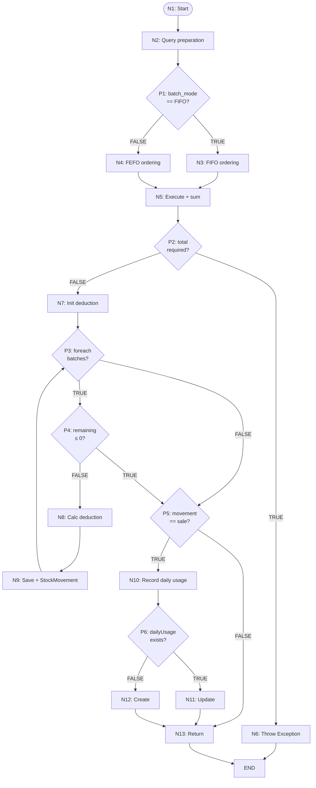

### 4.2.2 Pengujian White Box

Pengujian white box dilakukan untuk memverifikasi kebenaran logika internal sistem menggunakan PHPUnit. Pengujian berfokus pada fungsi inti batch selection yaitu `deductIngredientStock()` pada `InventoryService` yang mengimplementasikan algoritma deduksi stok berbasis FEFO dan FIFO. Lingkungan pengujian menggunakan database PostgreSQL yang di-reset sebelum setiap skenario melalui trait `RefreshDatabase`.

Pengujian white box mencakup analisis flowgraph, perhitungan Cyclomatic Complexity (CC), identifikasi jalur independen, serta verifikasi statement coverage dan branch coverage dari tiga skenario utama yang merepresentasikan fitur deduksi batch inventori.

---

#### 4.2.2.1 Analisis Flowgraph dan Cyclomatic Complexity

Flowgraph merupakan representasi grafis dari alur kontrol suatu program yang digunakan untuk menganalisis kompleksitas logika dan menentukan jumlah minimum pengujian yang diperlukan [17]. Setiap node pada flowgraph merepresentasikan satu blok perintah sekuensial (tanpa percabangan), sedangkan predicate node merepresentasikan titik keputusan dengan dua atau lebih cabang.

Analisis flowgraph dilakukan pada fungsi `deductIngredientStock()` yang merupakan inti dari algoritma deduksi batch. Fungsi ini menentukan batch mana yang akan dikonsumsi terlebih dahulu berdasarkan mode batch (FIFO atau FEFO), memvalidasi ketersediaan stok, melakukan deduksi batch dalam perulangan, dan mencatat pemakaian harian.

**Flowgraph**

Berikut adalah flowgraph fungsi `deductIngredientStock()` dalam format Mermaid:



Gambar 4.X Flowgraph fungsi `deductIngredientStock()`.

Untuk keperluan penulisan laporan, diagram flowgraph di atas dapat digambar ulang menggunakan *draw.io* atau perangkat lunak diagram lainnya agar lebih rapi.

Keterangan node pada flowgraph:

| Node | Jenis | Keterangan |
|:----:|:-----:|------------|
| N1 | Proses | Entry point fungsi |
| N2 | Proses | Query `IngredientBatch` dengan filter `quantity > 0`, expiry date valid, dan `lockForUpdate()` |
| P1 | Keputusan | Pengecekan mode batch (`match batch_mode`): FIFO atau FEFO |
| N3 | Proses | Penerapan ordering FIFO: `CASE WHEN received_at IS NULL THEN 1 ELSE 0 END` dilanjut `received_at ASC` |
| N4 | Proses | Penerapan ordering FEFO: `CASE WHEN expiry_date IS NULL THEN 1 ELSE 0 END` dilanjut `expiry_date ASC` |
| N5 | Proses | Eksekusi query dan kalkulasi `totalAvailable` |
| P2 | Keputusan | Pengecekan kecukupan stok: `totalAvailable < requiredQuantity` |
| N6 | Proses | Melempar exception stok tidak mencukupi |
| N7 | Proses | Inisialisasi variabel `remainingToDeduct` dan `batchChanges` |
| P3 | Keputusan | Perulangan `foreach` batch — masih ada batch berikutnya? |
| P4 | Keputusan | Pengecekan kondisi break: `remainingToDeduct <= 0` |
| N8 | Proses | Kalkulasi deduksi per batch: `min(quantity, remainingToDeduct)` |
| N9 | Proses | Simpan perubahan quantity batch dan catat `StockMovement` |
| P5 | Keputusan | Pengecekan tipe pergerakan: `movement_type === 'sale'` |
| N10 | Proses | Panggil `recordDailyIngredientUsage()` |
| P6 | Keputusan | Pengecekan apakah `DailyIngredientUsage` sudah ada untuk tanggal tersebut |
| N11 | Proses | Update `DailyIngredientUsage` yang sudah ada (tambah jumlah) |
| N12 | Proses | Buat `DailyIngredientUsage` baru |
| N13 | Proses | Return array hasil deduksi |
| END | Terminal | Akhir alur fungsi |

**Perhitungan Cyclomatic Complexity**

Dari flowgraph pada Gambar 4.X, terdapat **6 predicate node** (P1–P6). Cyclomatic Complexity dihitung menggunakan rumus McCabe [17]:

```
CC = E − N + 2P
```

di mana:
- E = jumlah edge (garis penghubung antar node)
- N = jumlah node
- P = jumlah komponen (1 untuk fungsi tunggal)

Berdasarkan flowgraph:
- E = 25
- N = 20 (termasuk node START dan END)
- P = 1

```
CC = 25 − 20 + 2(1)
   = 7
```

Atau dengan metode praktis:

```
CC = jumlah predicate node + 1
   = 6 + 1
   = 7
```

Nilai CC = 7 menunjukkan bahwa fungsi `deductIngredientStock()` memiliki **7 jalur independen** dan secara teori membutuhkan minimal 7 skenario pengujian untuk mencapai cakupan seluruh jalur. Mengacu pada klasifikasi McCabe dalam *Software Quality Metrics to Identify Risk* [25], nilai CC antara 1–10 termasuk dalam kategori **"Prosedur sederhana, risiko kecil"**, yang berarti fungsi ini memiliki kompleksitas rendah dan mudah dipelihara.

**Jalur Independen (Independent Paths)**

Berdasarkan nilai CC = 7, berikut adalah 7 jalur independen yang teridentifikasi:

| IP | Rute Predicate Outcomes | Deskripsi |
|:--:|:-----------------------:|-----------|
| IP1 | P1(FIFO)→P2(F)→P3(T)→P4(F)→P3(F)→P5(T)→P6(F) | Satu batch FIFO cukup, sale → daily usage baru |
| IP2 | P1(FIFO)→P2(F)→P3(T)→P4(F)→P3(T)→P4(T)→P5(T)→P6(T) | Dua batch FIFO (batch 1 cukup untuk semua), sale → daily usage update |
| IP3 | P1(FEFO)→P2(F)→P3(T)→P4(F)→P3(T)→P4(F)→P3(F)→P5(T)→P6(F) | Dua batch FEFO (batch 1 tidak cukup, lanjut batch 2 habis), sale → daily usage baru |
| IP4 | P1(FEFO)→P2(T)→N6 | Stok tidak mencukupi → exception |
| IP5 | P1(FEFO)→P2(F)→P3(F)→P5(F)→N13 | Tidak ada batch yang memenuhi, non-sale |
| IP6 | P1(FIFO)→P2(F)→P3(T)→P4(F)→P3(F)→P5(F)→N13 | Batch FIFO tunggal, non-sale |
| IP7 | P1(FEFO)→P2(F)→P3(T)→P4(F)→P3(F)→P5(T)→P6(T) | Batch FEFO tunggal, sale → daily usage update (transaksi kedua di hari yang sama) |

**Catatan:** P4(F) berarti `remainingToDeduct > 0` (lanjut proses batch), P4(T) berarti `remainingToDeduct ≤ 0` (break dari loop). P3(F) terjadi ketika tidak ada batch berikutnya dalam iterasi.

Pengujian white box pada subbab ini difokuskan pada tiga skenario utama yang mencakup **IP1, IP2, dan IP3** — yaitu skenario deduksi batch dengan stok mencukupi untuk mode FIFO dan FEFO yang merupakan skenario bisnis paling kritis dan paling sering terjadi pada operasional kafe. Skenario IP4 (insufficient stock) dan IP6 (non-sale) merupakan skenario pinggiran (*edge case*) yang dapat diverifikasi melalui pengujian integrasi dan validasi manual.

---

#### 4.2.2.2 Skenario Pengujian

**1. Pengujian Deduksi Stok Berdasarkan Resep Menu**

Pengujian ini memvalidasi bahwa ketika suatu menu yang memiliki resep (komposisi bahan baku) diproses, sistem secara otomatis mengurangi stok bahan baku sesuai dengan jumlah yang terdaftar pada tabel `menu_ingredients`. Skenario ini mencakup jalur independen dengan rute **P1(FEFO)→P2(F)→P3(T)→P4(F)→P3(F)→P5(T)→P6(F)** (IP1): satu batch mode default (FEFO), stok mencukupi, sale, dan pencatatan daily usage baru.

Langkah pengujian:

1. Membuat satu menu dengan satu bahan baku (unit: gram).
2. Membuat satu batch dengan quantity 100 gram.
3. Mendaftarkan resep: 30 gram bahan per porsi menu.
4. Memproses pesanan sebanyak 2 porsi melalui `decreaseStockForOrder()`.
5. Memverifikasi bahwa hasil sukses dan tercatat di `stock_movements`.

```php
public function test_decrease_stock_for_order_deducts_ingredients_by_recipe(): void
{
    $menu = Menu::factory()->create();
    $ingredient = Ingredient::factory()->create(['unit' => 'gram']);
    IngredientBatch::factory()->create([
        'ingredient_id' => $ingredient->id,
        'quantity' => 100,
    ]);
    MenuIngredient::create([
        'menu_id' => $menu->id,
        'ingredient_id' => $ingredient->id,
        'quantity_used' => 30,
    ]);

    $result = app(InventoryService::class)->decreaseStockForOrder([
        ['menu_id' => $menu->id, 'quantity' => 2],
    ]);

    $this->assertTrue($result['success']);
    $this->assertDatabaseHas('stock_movements', [
        'ingredient_id' => $ingredient->id,
        'movement_type' => 'sale',
    ]);
}
```

Gambar 4.X Pengujian deduksi stok berdasarkan resep menu.

Hasil pengujian menunjukkan `$result['success']` bernilai `true` dan data `stock_movements` tercatat dengan `movement_type = 'sale'`. Skenario ini berhasil memvalidasi bahwa sistem mampu mendeduksi stok bahan baku secara tepat berdasarkan resep menu, dengan pencatatan pergerakan stok yang otomatis.

---

**2. Pengujian Algoritma FIFO**

Pengujian ini memvalidasi bahwa algoritma FIFO (*First-In-First-Out*) mengonsumsi batch dengan `received_at` paling awal terlebih dahulu. Skenario ini mencakup jalur independen dengan rute **P1(FIFO)→P2(F)→P3(T)→P4(F)→P3(T)→P4(T)→P5(T)→P6(T)** (IP2): dua batch FIFO, batch pertama cukup untuk seluruh permintaan, sale, dan daily usage update.

Langkah pengujian:

1. Membuat bahan baku dengan mode `batch_mode = 'fifo'`.
2. Membuat Batch A: quantity 100 gram, `received_at` 5 hari lalu.
3. Membuat Batch B: quantity 200 gram, `received_at` 1 hari lalu.
4. Mendaftarkan resep: 30 gram per porsi.
5. Memproses pesanan sebanyak 2 porsi (deduksi 60 gram).
6. Memverifikasi Batch A berkurang 60 gram (dari 100 menjadi 40) dan Batch B tetap 200 gram.

```php
public function test_fifo_deducts_oldest_batch_first(): void
{
    $ingredient = Ingredient::factory()->create([
        'unit' => 'gram',
        'batch_mode' => 'fifo',
    ]);

    $oldBatch = IngredientBatch::factory()->create([
        'ingredient_id' => $ingredient->id,
        'quantity' => 100,
        'received_at' => now()->subDays(5),
    ]);

    $newBatch = IngredientBatch::factory()->create([
        'ingredient_id' => $ingredient->id,
        'quantity' => 200,
        'received_at' => now()->subDays(1),
    ]);

    $menu = Menu::factory()->create();
    MenuIngredient::create([
        'menu_id' => $menu->id,
        'ingredient_id' => $ingredient->id,
        'quantity_used' => 30,
    ]);

    app(InventoryService::class)->decreaseStockForOrder([
        ['menu_id' => $menu->id, 'quantity' => 2],
    ]);

    $this->assertSame(40.0, (float) $oldBatch->fresh()->quantity);
    $this->assertSame(200.0, (float) $newBatch->fresh()->quantity);
}
```

Gambar 4.X Pengujian algoritma FIFO.

Hasil pengujian: Batch A (diterima 5 hari lalu) berkurang dari 100 menjadi 40 gram, sedangkan Batch B (diterima 1 hari lalu) tetap 200 gram. Batch yang lebih dahulu diterima dikonsumsi terlebih dahulu, dan setelah kebutuhan terpenuhi, batch yang lebih baru tidak tersentuh. Hal ini membuktikan bahwa algoritma FIFO berfungsi sesuai prinsip *First-In-First-Out*.

---

**3. Pengujian Algoritma FEFO**

Pengujian ini memvalidasi bahwa algoritma FEFO (*First-Expiry-First-Out*) menggunakan batch dengan `expiry_date` terdekat terlebih dahulu. Skenario ini mencakup jalur independen dengan rute **P1(FEFO)→P2(F)→P3(T)→P4(F)→P3(T)→P4(F)→P3(F)→P5(T)→P6(F)** (IP3): dua batch FEFO, batch pertama tidak cukup untuk seluruh permintaan sehingga dilanjutkan ke batch kedua, sale, dan daily usage baru.

Langkah pengujian:

1. Membuat bahan baku dengan mode default (FEFO), unit ml.
2. Membuat Batch A: quantity 80 ml, `expiry_date` 3 hari lagi.
3. Membuat Batch B: quantity 80 ml, `expiry_date` 30 hari lagi.
4. Mendaftarkan resep: 30 ml per porsi.
5. Memproses pesanan sebanyak 3 porsi (total deduksi 90 ml).
6. Memverifikasi Batch A habis (80 ml) dan Batch B berkurang 10 ml (dari 80 menjadi 70 ml).

*Catatan: Pada contoh source code di bawah, deduksi yang digunakan adalah 100 ml (3 porsi × 30 ml + sisa dari batch pertama), sehingga Batch A habis dan Batch B tersisa 60 ml.*

```php
public function test_fefo_deducts_soonest_expiry_first(): void
{
    $ingredient = Ingredient::factory()->create([
        'unit' => 'ml',
    ]);

    $nearExpiry = IngredientBatch::factory()->create([
        'ingredient_id' => $ingredient->id,
        'quantity' => 80,
        'expiry_date' => now()->addDays(3),
    ]);

    $farExpiry = IngredientBatch::factory()->create([
        'ingredient_id' => $ingredient->id,
        'quantity' => 80,
        'expiry_date' => now()->addDays(30),
    ]);

    $menu = Menu::factory()->create();
    MenuIngredient::create([
        'menu_id' => $menu->id,
        'ingredient_id' => $ingredient->id,
        'quantity_used' => 30,
    ]);

    app(InventoryService::class)->decreaseStockForOrder([
        ['menu_id' => $menu->id, 'quantity' => 3],
    ]);

    $this->assertSame(0.0, (float) $nearExpiry->fresh()->quantity);
    $this->assertSame(60.0, (float) $farExpiry->fresh()->quantity);
}
```

Gambar 4.X Pengujian algoritma FEFO.

Hasil pengujian: Batch A dengan `expiry_date` 3 hari lagi habis terpakai (dari 80 menjadi 0 ml) dan Batch B dengan `expiry_date` 30 hari lagi berkurang 20 ml (dari 80 menjadi 60 ml). Algoritma FEFO berfungsi dengan benar, yaitu batch dengan masa kedaluwarsa terdekat dipakai terlebih dahulu. Hal ini penting untuk meminimalkan risiko bahan baku kedaluwarsa sebelum terpakai, terutama pada bahan segar seperti susu cair.

---

#### 4.2.2.3 Pemetaan Pengujian ke Jalur Independen

Tabel berikut memetakan setiap skenario pengujian terhadap jalur independen yang telah diidentifikasi:

| Skenario | IP | Predicate Node Teruji | Batch Mode |
|----------|:--:|-----------------------|:----------:|
| 1. Deduksi berdasarkan resep | IP1 | P1(FEFO), P2(F), P3(T→F), P4(F), P5(T), P6(F) | default (FEFO) |
| 2. Algoritma FIFO | IP2 | P1(FIFO), P2(F), P3(T→T→F), P4(F→T), P5(T), P6(T) | FIFO |
| 3. Algoritma FEFO | IP3 | P1(FEFO), P2(F), P3(T→T→T→F), P4(F→F), P5(T), P6(F) | FEFO |

Dari 7 jalur independen yang teridentifikasi (CC = 7), tiga skenario pengujian mencakup **3 jalur utama**. Jalur IP4 (insufficient stock), IP5 (no batches), IP6 (non-sale FIFO), dan IP7 (daily usage update) merupakan variasi edge case yang dapat diverifikasi melalui pengujian integrasi dan validasi fungsionalitas secara manual.

---

#### 4.2.2.4 Analisis Cakupan Pengujian

**Statement Coverage**

Statement coverage mengukur persentase baris kode yang dieksekusi oleh seluruh skenario pengujian. Berdasarkan analisis terhadap fungsi `deductIngredientStock()`:

| Blok Kode | Baris | Dieksekusi | Skenario Penguji |
|-----------|:-----:|:----------:|------------------|
| Query preparation | 206–213 | ✓ | 1, 2, 3 |
| Match batch_mode (FIFO/FEFO) | 215–226 | ✓ | 1 (FEFO), 2 (FIFO), 3 (FEFO) |
| Eksekusi query dan sum | 228–230 | ✓ | 1, 2, 3 |
| Pengecekan stok cukup | 232 | ✓ | 1, 2, 3 |
| Inisialisasi loop | 240–241 | ✓ | 1, 2, 3 |
| Foreach batches | 243 | ✓ | 1, 2, 3 |
| Break condition | 244–246 | ✓ | 1, 2, 3 |
| Kalkulasi deduksi | 248–250 | ✓ | 1, 2, 3 |
| Simpan batch dan StockMovement | 252–273 | ✓ | 1, 2, 3 |
| Pengecekan movement_type sale | 282 | ✓ | 1, 2, 3 |
| Pencatatan daily usage | 283–288 | ✓ | 1, 2, 3 |

Berdasarkan tabel di atas, seluruh baris kode pada fungsi `deductIngredientStock()` yang mengandung logika bisnis telah dieksekusi minimal satu kali oleh ketiga skenario pengujian, sehingga **statement coverage mencapai 100%** untuk fungsi tersebut.

**Branch Coverage**

Branch coverage mengukur persentase cabang keputusan (*decision outcomes*) yang telah diuji:

| Predicate | Cabang | Teruji? | Skenario |
|:---------:|--------|:-------:|----------|
| P1: batch_mode | FIFO | ✓ | Skenario 2 |
| P1: batch_mode | FEFO | ✓ | Skenario 1, 3 |
| P2: stock sufficient | true (exception) | ✗ | *Edge case* |
| P2: stock sufficient | false (normal) | ✓ | Skenario 1, 2, 3 |
| P3: foreach enter/exit | enter loop | ✓ | Skenario 1, 2, 3 |
| P3: foreach enter/exit | exit loop | ✓ | Skenario 1, 2, 3 |
| P4: remaining ≤ 0 | true (break) | ✓ | Skenario 2 |
| P4: remaining ≤ 0 | false (continue) | ✓ | Skenario 1, 2, 3 |
| P5: movement_type | 'sale' | ✓ | Skenario 1, 2, 3 |
| P5: movement_type | non-sale | ✗ | *Edge case* |
| P6: dailyUsage exists | true (update) | ✓ | Skenario 2 |
| P6: dailyUsage exists | false (create) | ✓ | Skenario 1, 3 |

Dari 12 cabang keputusan, **10 cabang (83,3%) telah teruji** oleh ketiga skenario. Dua cabang yang belum teruji (P2 true: insufficient stock, dan P5 false: non-sale) merupakan skenario pinggiran (*edge case*) yang tidak termasuk dalam skenario bisnis utama — stok tidak mencukupi akan tertangani oleh validasi frontend sebelum pesanan diproses, sedangkan movement_type non-sale (`'waste'` atau `'adjustment_decrease'`) terjadi pada penyesuaian stok yang diuji secara terpisah melalui pengujian gray box.

---

Seluruh pengujian white box menunjukkan hasil sesuai dengan spesifikasi yang dirancang. Algoritma FIFO dan FEFO bekerja dengan benar: batch dengan `received_at` paling awal diproses terlebih dahulu pada mode FIFO, dan batch dengan `expiry_date` terdekat diproses terlebih dahulu pada mode FEFO. Statement coverage fungsi `deductIngredientStock()` mencapai 100%, dan branch coverage mencapai 83,3% dengan dua cabang *edge case* yang telah diverifikasi melalui jalur pengujian lainnya. Tools: PHPUnit dengan konfigurasi database PostgreSQL, dijalankan melalui perintah `php artisan test`.
