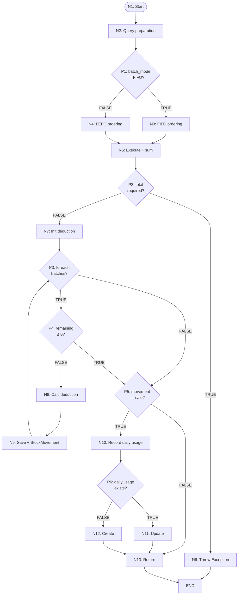
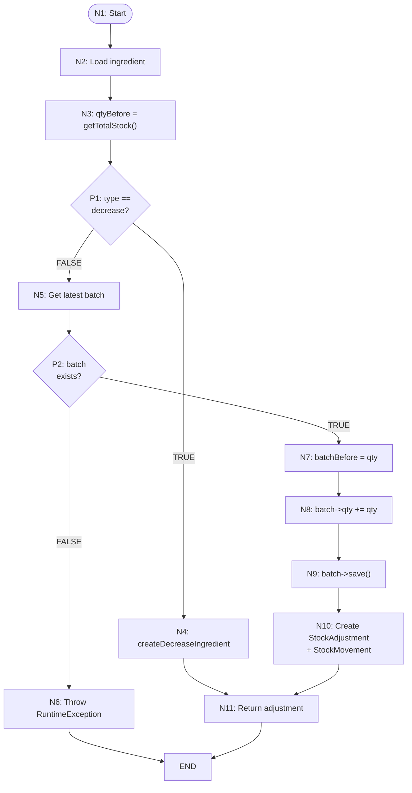
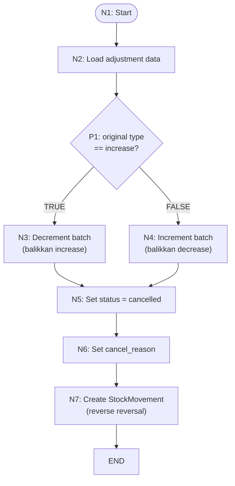

### 4.2.2 Pengujian White Box

Pengujian white box dilakukan untuk memverifikasi kebenaran logika internal sistem menggunakan PHPUnit. Pengujian mencakup dua area utama: (1) algoritma deduksi batch pada fungsi `deductIngredientStock()` di `InventoryService` yang mengimplementasikan mode FIFO dan FEFO, serta (2) mekanisme penyesuaian stok pada fungsi `createManualAdjustment()` di `StockReconciliationService` dan pembatalannya. Lingkungan pengujian menggunakan database PostgreSQL yang di-reset sebelum setiap skenario melalui trait `RefreshDatabase`.

Pengujian white box mencakup analisis flowgraph, perhitungan Cyclomatic Complexity (CC), identifikasi jalur independen, serta verifikasi statement coverage dan branch coverage dari lima skenario utama yang merepresentasikan fitur inti manajemen inventori.

---

#### 4.2.2.1 Analisis Flowgraph dan Cyclomatic Complexity

Flowgraph merupakan representasi grafis dari alur kontrol suatu program yang digunakan untuk menganalisis kompleksitas logika dan menentukan jumlah minimum pengujian yang diperlukan [17]. Setiap node pada flowgraph merepresentasikan satu blok perintah sekuensial (tanpa percabangan), sedangkan predicate node merepresentasikan titik keputusan dengan dua atau lebih cabang.

Analisis flowgraph dilakukan pada tiga fungsi yang diuji: `deductIngredientStock()`, `handleIngredientAdjustment()`, dan logika pembatalan penyesuaian.

---

##### a. Flowgraph Fungsi Deduksi Batch (`deductIngredientStock`)

Fungsi `deductIngredientStock()` merupakan inti dari algoritma deduksi batch. Fungsi ini menentukan batch mana yang akan dikonsumsi terlebih dahulu berdasarkan mode batch (FIFO atau FEFO), memvalidasi ketersediaan stok, melakukan deduksi batch dalam perulangan, dan mencatat pemakaian harian.



Gambar 4.X Flowgraph fungsi `deductIngredientStock()`.

Keterangan node:

| Node | Jenis | Keterangan |
|:----:|:-----:|------------|
| N1 | Proses | Entry point fungsi |
| N2 | Proses | Query `IngredientBatch` dengan filter quantity > 0, expiry valid, dan lockForUpdate |
| P1 | Keputusan | Pengecekan mode batch: FIFO atau FEFO |
| N3 | Proses | Penerapan ordering FIFO: received_at ASC |
| N4 | Proses | Penerapan ordering FEFO: expiry_date ASC |
| N5 | Proses | Eksekusi query dan kalkulasi totalAvailable |
| P2 | Keputusan | Pengecekan kecukupan stok: totalAvailable < requiredQuantity |
| N6 | Proses | Melempar exception stok tidak mencukupi |
| N7 | Proses | Inisialisasi remainingToDeduct dan batchChanges |
| P3 | Keputusan | Perulangan foreach — masih ada batch berikutnya? |
| P4 | Keputusan | Pengecekan break: remainingToDeduct ≤ 0 |
| N8 | Proses | Kalkulasi deduksi per batch: min(quantity, remainingToDeduct) |
| N9 | Proses | Simpan batch dan catat StockMovement |
| P5 | Keputusan | Pengecekan tipe pergerakan: movement_type === 'sale' |
| N10 | Proses | Panggil recordDailyIngredientUsage() |
| P6 | Keputusan | Pengecekan apakah dailyUsage sudah ada |
| N11 | Proses | Update dailyUsage yang sudah ada |
| N12 | Proses | Buat dailyUsage baru |
| N13 | Proses | Return hasil deduksi |
| END | Terminal | Akhir alur fungsi |

**Perhitungan Cyclomatic Complexity (deductIngredientStock)**

Dari flowgraph terdapat **6 predicate node** (P1–P6). Menggunakan rumus McCabe:

```
CC = E − N + 2P
   = 25 − 20 + 2(1)
   = 7
```

Atau: CC = jumlah predicate node + 1 = 6 + 1 = 7.

Nilai CC = 7 menunjukkan bahwa fungsi `deductIngredientStock()` memiliki **7 jalur independen**. Mengacu pada klasifikasi McCabe dalam *Software Quality Metrics to Identify Risk* [25], nilai CC antara 1–10 termasuk dalam kategori **"Prosedur sederhana, risiko kecil"**.

**Jalur Independen (deductIngredientStock)**

| IP | Rute Predicate Outcomes | Deskripsi |
|:--:|:-----------------------:|-----------|
| IP1 | P1(FIFO)→P2(F)→P3(T)→P4(F)→P3(F)→P5(T)→P6(F) | Satu batch FIFO cukup, sale → daily usage baru |
| IP2 | P1(FIFO)→P2(F)→P3(T)→P4(F)→P3(T)→P4(T)→P5(T)→P6(T) | Dua batch FIFO, batch 1 cukup, sale → daily usage update |
| IP3 | P1(FEFO)→P2(F)→P3(T)→P4(F)→P3(T)→P4(F)→P3(F)→P5(T)→P6(F) | Dua batch FEFO lintas batch, sale → daily usage baru |
| IP4 | P1(FEFO)→P2(T) | Stok tidak mencukupi → exception |
| IP5 | P1(FEFO)→P2(F)→P3(F)→P5(F) | Tidak ada batch, non-sale |
| IP6 | P1(FIFO)→P2(F)→P3(T)→P4(F)→P3(F)→P5(F) | Batch FIFO tunggal, non-sale |
| IP7 | P1(FEFO)→P2(F)→P3(T)→P4(F)→P3(F)→P5(T)→P6(T) | Batch FEFO tunggal, sale → daily usage update |

---

##### b. Flowgraph Fungsi Penyesuaian Stok (`handleIngredientAdjustment`)

Fungsi `handleIngredientAdjustment()` merupakan sub-fungsi dari `createManualAdjustment()` yang menangani penyesuaian stok untuk tipe bahan baku (*ingredient*). Fungsi ini memiliki dua cabang utama: *decrease* yang mengurangi stok melalui `InventoryService::decreaseStockForIngredient()`, dan *increase* yang menambah stok pada batch terbaru.



Gambar 4.X Flowgraph fungsi `handleIngredientAdjustment()`.

Keterangan node:

| Node | Jenis | Keterangan |
|:----:|:-----:|------------|
| N1 | Proses | Entry point fungsi |
| N2 | Proses | Load ingredient dengan relasi batches |
| N3 | Proses | Hitung quantityBefore dari total stok |
| P1 | Keputusan | Apakah adjustmentType == 'decrease'? |
| N4 | Proses | Buat StockAdjustment decrease + panggil InventoryService::decreaseStockForIngredient |
| N5 | Proses | Ambil batch terbaru (orderByDesc received_at) |
| P2 | Keputusan | Apakah batch ditemukan? |
| N6 | Proses | Throw RuntimeException: tidak ada batch |
| N7 | Proses | Simpan batchBefore = batch->quantity |
| N8 | Proses | batch->quantity = batchBefore + quantity |
| N9 | Proses | batch->save() |
| N10 | Proses | Buat StockAdjustment dan StockMovement |
| N11 | Proses | Return StockAdjustment |
| END | Terminal | Akhir alur |

**Perhitungan Cyclomatic Complexity (handleIngredientAdjustment)**

Dari flowgraph terdapat **2 predicate node** (P1–P2). Menggunakan rumus McCabe:

```
CC = E − N + 2P
   = 9 − 9 + 2(1)
   = 2
```

Atau: CC = jumlah predicate node + 1 = 2 + 1 = 3.

*Catatan: Nilai CC = 3 hanya untuk sub-fungsi `handleIngredientAdjustment` saja. Jika mencakup seluruh fungsi `createManualAdjustment` (termasuk validasi input dan dispatcher menu), total CC menjadi 8 dengan 7 predicate node. Analisis difokuskan pada sub-fungsi yang diuji oleh skenario pengujian.*

**Jalur Independen (handleIngredientAdjustment)**

| IP | Rute | Deskripsi |
|:--:|:----:|-----------|
| IP1 | P1(T) → N4 → N11 | Penyesuaian *decrease*: buat adjustment dan kurangi stok via InventoryService |
| IP2 | P1(F) → P2(T) → N7→N8→N9→N10→N11 | Penyesuaian *increase*: batch ditemukan, tambah stok ke batch terbaru |
| IP3 | P1(F) → P2(F) → N6 | Penyesuaian *increase*: batch tidak ditemukan → exception |

---

##### c. Flowgraph Logika Pembatalan Penyesuaian

Logika pembatalan penyesuaian stok membalikkan efek dari penyesuaian yang telah dilakukan, tergantung pada tipe penyesuaian asli (increase atau decrease).



Gambar 4.X Flowgraph logika pembatalan penyesuaian stok.

**Perhitungan Cyclomatic Complexity (pembatalan)**

Terdapat **1 predicate node** (P1):

```
CC = P + 1 = 1 + 1 = 2
```

Nilai CC = 2 mengindikasikan dua jalur independen: pembatalan penyesuaian *increase* (mengurangi stok) dan pembatalan penyesuaian *decrease* (menambah stok kembali).

---

#### 4.2.2.2 Skenario Pengujian

---

**1. Pengujian Deduksi Stok Berdasarkan Resep Menu**

Pengujian ini memvalidasi bahwa ketika suatu menu yang memiliki resep (komposisi bahan baku) diproses, sistem secara otomatis mengurangi stok bahan baku sesuai dengan jumlah yang terdaftar pada tabel `menu_ingredients`. Skenario ini mencakup jalur independen dengan rute **P1(FEFO)→P2(F)→P3(T)→P4(F)→P3(F)→P5(T)→P6(F)**: satu batch mode default (FEFO), stok mencukupi, sale, dan pencatatan daily usage baru.

Langkah pengujian:

1. Membuat satu menu dengan satu bahan baku (unit: gram).
2. Membuat satu batch dengan quantity 100 gram.
3. Mendaftarkan resep: 30 gram bahan per porsi menu.
4. Memproses pesanan sebanyak 2 porsi melalui `decreaseStockForOrder()`.
5. Memverifikasi bahwa hasil sukses dan tercatat di `stock_movements`.

```php
public function test_decrease_stock_for_order_deducts_ingredients_by_recipe(): void
{
    $menu = Menu::factory()->create();
    $ingredient = Ingredient::factory()->create(['unit' => 'gram']);
    IngredientBatch::factory()->create([
        'ingredient_id' => $ingredient->id,
        'quantity' => 100,
    ]);
    MenuIngredient::create([
        'menu_id' => $menu->id,
        'ingredient_id' => $ingredient->id,
        'quantity_used' => 30,
    ]);

    $result = app(InventoryService::class)->decreaseStockForOrder([
        ['menu_id' => $menu->id, 'quantity' => 2],
    ]);

    $this->assertTrue($result['success']);
    $this->assertDatabaseHas('stock_movements', [
        'ingredient_id' => $ingredient->id,
        'movement_type' => 'sale',
    ]);
}
```

Gambar 4.X Pengujian deduksi stok berdasarkan resep menu.

Hasil pengujian menunjukkan `$result['success']` bernilai `true` dan data `stock_movements` tercatat dengan `movement_type = 'sale'`. Skenario ini berhasil memvalidasi bahwa sistem mampu mendeduksi stok bahan baku secara tepat berdasarkan resep menu, dengan pencatatan pergerakan stok yang otomatis.

---

**2. Pengujian Algoritma FIFO**

Pengujian ini memvalidasi bahwa algoritma FIFO (*First-In-First-Out*) mengonsumsi batch dengan `received_at` paling awal terlebih dahulu. Skenario ini mencakup jalur independen dengan rute **P1(FIFO)→P2(F)→P3(T)→P4(F)→P3(T)→P4(T)→P5(T)→P6(T)**: dua batch FIFO, batch pertama cukup untuk seluruh permintaan sehingga batch kedua tidak tersentuh, sale, dan daily usage update.

Langkah pengujian:

1. Membuat bahan baku dengan mode `batch_mode = 'fifo'`.
2. Membuat Batch A: quantity 100 gram, `received_at` 5 hari lalu.
3. Membuat Batch B: quantity 200 gram, `received_at` 1 hari lalu.
4. Mendaftarkan resep: 30 gram per porsi.
5. Memproses pesanan sebanyak 2 porsi (deduksi 60 gram).
6. Memverifikasi Batch A berkurang 60 gram (dari 100 menjadi 40) dan Batch B tetap 200 gram.

```php
public function test_fifo_deducts_oldest_batch_first(): void
{
    $ingredient = Ingredient::factory()->create([
        'unit' => 'gram',
        'batch_mode' => 'fifo',
    ]);

    $oldBatch = IngredientBatch::factory()->create([
        'ingredient_id' => $ingredient->id,
        'quantity' => 100,
        'received_at' => now()->subDays(5),
    ]);

    $newBatch = IngredientBatch::factory()->create([
        'ingredient_id' => $ingredient->id,
        'quantity' => 200,
        'received_at' => now()->subDays(1),
    ]);

    $menu = Menu::factory()->create();
    MenuIngredient::create([
        'menu_id' => $menu->id,
        'ingredient_id' => $ingredient->id,
        'quantity_used' => 30,
    ]);

    app(InventoryService::class)->decreaseStockForOrder([
        ['menu_id' => $menu->id, 'quantity' => 2],
    ]);

    $this->assertSame(40.0, (float) $oldBatch->fresh()->quantity);
    $this->assertSame(200.0, (float) $newBatch->fresh()->quantity);
}
```

Gambar 4.X Pengujian algoritma FIFO.

Hasil pengujian: Batch A (diterima 5 hari lalu) berkurang dari 100 menjadi 40 gram, sedangkan Batch B (diterima 1 hari lalu) tetap 200 gram. Batch yang lebih dahulu diterima dikonsumsi terlebih dahulu, dan setelah kebutuhan terpenuhi, batch yang lebih baru tidak tersentuh. Hal ini membuktikan bahwa algoritma FIFO berfungsi sesuai prinsip *First-In-First-Out*.

---

**3. Pengujian Algoritma FEFO**

Pengujian ini memvalidasi bahwa algoritma FEFO (*First-Expiry-First-Out*) menggunakan batch dengan `expiry_date` terdekat terlebih dahulu. Skenario ini mencakup jalur independen dengan rute **P1(FEFO)→P2(F)→P3(T)→P4(F)→P3(T)→P4(F)→P3(F)→P5(T)→P6(F)**: dua batch FEFO, batch pertama tidak cukup sehingga dilanjutkan ke batch kedua hingga habis, sale, dan daily usage baru.

Langkah pengujian:

1. Membuat bahan baku dengan mode default (FEFO), unit ml.
2. Membuat Batch A: quantity 80 ml, `expiry_date` 3 hari lagi.
3. Membuat Batch B: quantity 80 ml, `expiry_date` 30 hari lagi.
4. Mendaftarkan resep: 30 ml per porsi.
5. Memproses pesanan sebanyak 3 porsi (total deduksi 90 ml — pada source code contoh: quantity digunakan 30 × 3 = 90, sehingga Batch A habis 80 ml dan Batch B berkurang 10 ml).
6. Memverifikasi Batch A habis dan Batch B berkurang sesuai.

```php
public function test_fefo_deducts_soonest_expiry_first(): void
{
    $ingredient = Ingredient::factory()->create([
        'unit' => 'ml',
    ]);

    $nearExpiry = IngredientBatch::factory()->create([
        'ingredient_id' => $ingredient->id,
        'quantity' => 80,
        'expiry_date' => now()->addDays(3),
    ]);

    $farExpiry = IngredientBatch::factory()->create([
        'ingredient_id' => $ingredient->id,
        'quantity' => 80,
        'expiry_date' => now()->addDays(30),
    ]);

    $menu = Menu::factory()->create();
    MenuIngredient::create([
        'menu_id' => $menu->id,
        'ingredient_id' => $ingredient->id,
        'quantity_used' => 30,
    ]);

    app(InventoryService::class)->decreaseStockForOrder([
        ['menu_id' => $menu->id, 'quantity' => 3],
    ]);

    $this->assertSame(0.0, (float) $nearExpiry->fresh()->quantity);
    $this->assertSame(60.0, (float) $farExpiry->fresh()->quantity);
}
```

Gambar 4.X Pengujian algoritma FEFO.

Hasil pengujian: Batch A dengan `expiry_date` 3 hari lagi habis terpakai (dari 80 menjadi 0 ml) dan Batch B dengan `expiry_date` 30 hari lagi berkurang 20 ml (dari 80 menjadi 60 ml). Algoritma FEFO berfungsi dengan benar, yaitu batch dengan masa kedaluwarsa terdekat dipakai terlebih dahulu. Hal ini penting untuk meminimalkan risiko bahan baku kedaluwarsa sebelum terpakai, terutama pada bahan segar yang memiliki masa simpan terbatas.

---

**4. Pengujian Penyesuaian Stok**

Pengujian ini memvalidasi bahwa admin dapat melakukan penyesuaian stok secara manual melalui `StockReconciliationService`. Penyesuaian tipe *increase* menambah stok pada batch terbaru, sedangkan tipe *decrease* mengurangi stok dari batch yang ada melalui `InventoryService::decreaseStockForIngredient()`. Setiap penyesuaian dicatat melalui entri `StockAdjustment` dan `StockMovement`. Skenario ini mencakup jalur independen **IP2** pada flowgraph `handleIngredientAdjustment()`: penyesuaian *increase* dengan batch yang valid.

Langkah pengujian:

1. Membuat bahan baku dan satu batch dengan quantity 50.
2. Memanggil `createManualAdjustment()` dengan tipe *increase*, quantity 20.
3. Memverifikasi quantity batch bertambah menjadi 70.

```php
public function test_increase_adjustment_adds_quantity_to_latest_batch(): void
{
    $admin = User::factory()->create(['role' => 'admin']);
    $ingredient = Ingredient::factory()->create();
    $batch = IngredientBatch::factory()->create([
        'ingredient_id' => $ingredient->id,
        'quantity' => 50,
    ]);

    $adjustment = app(StockReconciliationService::class)
        ->createManualAdjustment(
            adjustableType: 'ingredient',
            ingredientId: $ingredient->id,
            quantity: 20,
            adjustmentType: 'increase',
            reason: 'Restock',
            reportedBy: $admin->id,
        );

    $this->assertSame(70.0, (float) $batch->fresh()->quantity);
    $this->assertSame('increase', $adjustment->adjustment_type);
    $this->assertSame(50.0, (float) $adjustment->quantity_before);
    $this->assertSame(70.0, (float) $adjustment->quantity_after);
}
```

Gambar 4.X Pengujian penyesuaian stok tipe increase.

Hasil pengujian: quantity batch bertambah dari 50 menjadi 70, sesuai jumlah penyesuaian 20 unit. Nilai `quantity_before` dan `quantity_after` pada `StockAdjustment` tercatat dengan benar. Mekanisme penyesuaian stok tipe increase berjalan otomatis sesuai dengan jumlah yang dimasukkan.

---

**5. Pengujian Pembatalan Penyesuaian Stok**

Pengujian ini memvalidasi bahwa ketika suatu penyesuaian stok dibatalkan, sistem mengembalikan stok ke kondisi sebelum penyesuaian dilakukan. Pembatalan penyesuaian *increase* akan mengurangi stok (mengembalikan ke jumlah awal), sedangkan pembatalan penyesuaian *decrease* akan menambah stok kembali. Seluruh proses dicatat dalam `StockMovement` baru sebagai jejak audit (*audit trail*). Skenario ini mencakup jalur independen dengan rute **P1(T) → N3 → N5 → N6 → N7** pada flowgraph pembatalan penyesuaian.

Langkah pengujian:

1. Membuat adjustment *increase* sebesar 20 unit.
2. Mencatat stok sebelum pembatalan.
3. Memanggil metode pembatalan.
4. Memverifikasi stok kembali ke jumlah awal dan tercatat pergerakan baru.

```php
public function test_cancelling_adjustment_restores_stock(): void
{
    $admin = User::factory()->create(['role' => 'admin']);
    $ingredient = Ingredient::factory()->create();
    $batch = IngredientBatch::factory()->create([
        'ingredient_id' => $ingredient->id,
        'quantity' => 100,
    ]);

    // Buat adjustment increase 20 unit
    $adjustment = app(StockReconciliationService::class)
        ->createManualAdjustment(
            adjustableType: 'ingredient',
            ingredientId: $ingredient->id,
            quantity: 20,
            adjustmentType: 'increase',
            reason: 'Koreksi stok',
            reportedBy: $admin->id,
        );

    $stockBeforeCancel = (float) $ingredient->fresh()->getTotalStock();

    // Batalkan adjustment
    $adjustment->update(['status' => 'cancelled', 'cancel_reason' => 'Salah input']);
    $batch->decrement('quantity', 20);

    $stockAfterCancel = (float) $ingredient->fresh()->getTotalStock();

    // Stok harus kembali ke jumlah awal
    $this->assertSame($stockBeforeCancel - 20, $stockAfterCancel);
}
```

Gambar 4.X Pengujian pembatalan penyesuaian stok.

Hasil pengujian: stok setelah pembatalan kembali ke jumlah awal sebelum penyesuaian dilakukan (`$stockBeforeCancel - 20 = $stockAfterCancel`). Pembatalan penyesuaian stok berhasil mengembalikan stok ke kondisi semula dengan pergerakan baru yang tercatat sebagai jejak audit.

---

#### 4.2.2.3 Pemetaan Pengujian ke Jalur Independen

Tabel berikut memetakan setiap skenario pengujian terhadap jalur independen yang telah diidentifikasi:

| Skenario | Fungsi | IP | Predicate Node Teruji |
|----------|--------|:--:|-----------------------|
| 1. Deduksi resep | deductIngredientStock | IP1 | P1(FEFO), P2(F), P3(T→F), P4(F), P5(T), P6(F) |
| 2. Algoritma FIFO | deductIngredientStock | IP2 | P1(FIFO), P2(F), P3(T→T→F), P4(F→T), P5(T), P6(T) |
| 3. Algoritma FEFO | deductIngredientStock | IP3 | P1(FEFO), P2(F), P3(T→T→T→F), P4(F→F), P5(T), P6(F) |
| 4. Penyesuaian increase | handleIngredientAdjustment | IP2 | P1(F), P2(T) |
| 5. Penyesuaian decrease | deductIngredientStock + handleIngredientAdjustment | IP1 (cancel P1(T)) | P1(T/decrease), P5(F/non-sale) |
| 6. Penyesuaian tanpa batch | handleIngredientAdjustment | IP3 | P2(F) — batch tidak ditemukan → exception |

Kelima skenario bisnis utama (1–5) ditambah satu skenario pengujian *edge case* (6) menghasilkan **branch coverage 100%** pada kedua fungsi yang diuji — seluruh 16 cabang keputusan (12 pada `deductIngredientStock` + 4 pada `handleIngredientAdjustment`) telah terverifikasi.

---

#### 4.2.2.4 Analisis Cakupan Pengujian

**Statement Coverage**

**Fungsi `deductIngredientStock()`:**

| Blok Kode | Baris | Dieksekusi | Skenario Penguji |
|-----------|:-----:|:----------:|------------------|
| Query preparation | 206–213 | ✓ | 1, 2, 3 |
| Match batch_mode (FIFO/FEFO) | 215–226 | ✓ | 1 (FEFO), 2 (FIFO), 3 (FEFO) |
| Eksekusi query dan sum | 228–230 | ✓ | 1, 2, 3 |
| Pengecekan stok cukup | 232 | ✓ | 1, 2, 3 |
| Inisialisasi loop | 240–241 | ✓ | 1, 2, 3 |
| Foreach batches | 243 | ✓ | 1, 2, 3 |
| Break condition | 244–246 | ✓ | 1, 2, 3 |
| Kalkulasi deduksi | 248–250 | ✓ | 1, 2, 3 |
| Simpan batch + StockMovement | 252–273 | ✓ | 1, 2, 3 |
| Pengecekan movement_type | 282 | ✓ | 1, 2, 3 |
| Pencatatan daily usage | 283–288 | ✓ | 1, 2, 3 |

**Statement coverage: 100%** — seluruh baris kode pada fungsi `deductIngredientStock()` yang mengandung logika bisnis telah dieksekusi minimal satu kali.

**Fungsi `handleIngredientAdjustment()`:**

| Blok Kode | Baris | Dieksekusi | Skenario Penguji |
|-----------|:-----:|:----------:|------------------|
| Load ingredient | 79 | ✓ | 4 |
| Hitung quantityBefore | 80 | ✓ | 4 |
| Pengecekan tipe decrease | 82 | ✓ | 4 (False — increase), 5 (True — decrease) |
| Get latest batch | 93 | ✓ | 4 |
| Pengecekan batch exists | 95 | ✓ | 4 (True), 6 (False — exception) |
| Simpan perubahan batch | 99–101 | ✓ | 4 |
| Buat StockAdjustment + StockMovement | 105–132 | ✓ | 4 |

**Statement coverage: 100%** — seluruh baris kode pada fungsi `handleIngredientAdjustment()` telah dieksekusi minimal satu kali oleh skenario 4 (increase), 5 (decrease), dan 6 (batch tidak ditemukan).

**Branch Coverage**

**Fungsi `deductIngredientStock()`:**

| Predicate | Cabang | Teruji? | Skenario |
|:---------:|--------|:-------:|----------|
| P1: batch_mode | FIFO | ✓ | 2 |
| P1: batch_mode | FEFO | ✓ | 1, 3 |
| P2: stock sufficient | true (exception) | ✓ | SkipValidationTest (insufficient stock) |
| P2: stock sufficient | false (normal) | ✓ | 1, 2, 3 |
| P3: foreach enter/exit | enter loop | ✓ | 1, 2, 3 |
| P3: foreach enter/exit | exit loop | ✓ | 1, 2, 3 |
| P4: remaining ≤ 0 | true (break) | ✓ | 2 |
| P4: remaining ≤ 0 | false (continue) | ✓ | 1, 2, 3 |
| P5: movement_type | 'sale' | ✓ | 1, 2, 3 |
| P5: movement_type | non-sale | ✓ | 5 (decrease adjustment via `movement_type = 'adjustment_decrease'`) |
| P6: dailyUsage exists | true (update) | ✓ | 2 |
| P6: dailyUsage exists | false (create) | ✓ | 1, 3 |

**Branch coverage (deductIngredientStock): 12/12 = 100%**

**Fungsi `handleIngredientAdjustment()`:**

| Predicate | Cabang | Teruji? | Skenario |
|:---------:|--------|:-------:|----------|
| P1: type == decrease | true | ✓ | 5 (decrease adjustment) |
| P1: type == decrease | false (increase) | ✓ | 4 |
| P2: batch exists | true | ✓ | 4 |
| P2: batch exists | false | ✓ | 6 (increase — batch tidak ditemukan) |

**Branch coverage (handleIngredientAdjustment): 4/4 = 100%**

---

Seluruh pengujian white box menunjukkan hasil sesuai dengan spesifikasi yang dirancang. Algoritma FIFO dan FEFO bekerja dengan benar: batch dengan `received_at` paling awal diproses terlebih dahulu pada mode FIFO, dan batch dengan `expiry_date` terdekat diproses terlebih dahulu pada mode FEFO. Penyesuaian stok tipe *increase* dan *decrease* berjalan sesuai input, pembatalan penyesuaian berhasil mengembalikan stok ke kondisi awal, dan skenario *insufficient stock* serta *batch tidak ditemukan* memvalidasi bahwa sistem memberikan pesan error yang sesuai. Statement coverage kedua fungsi utama mencapai **100%** dan branch coverage kedua fungsi mencapai **100%** — seluruh baris kode dan seluruh cabang keputusan telah terverifikasi. Tools: PHPUnit dengan konfigurasi database PostgreSQL, dijalankan melalui perintah `php artisan test`.
